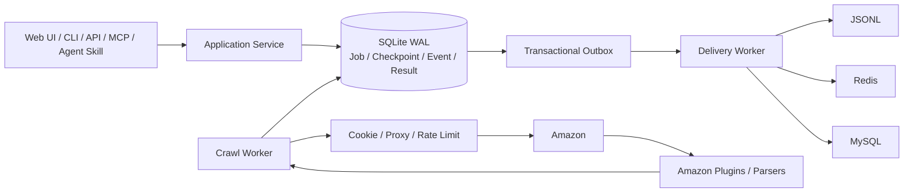

# Amazon Crawler V2

面向 Amazon 数据采集场景的可恢复、可观测爬虫服务。项目提供管理界面、HTTP API、命令行、MCP Server/Client 和 Agent Skill，统一承载任务创建、断点续爬、暂停/恢复、结果查询、多存储投递以及 Cookie/代理资源管理。

> 当前阶段：P0 核心能力和离线测试已完成；MCP 已具备认证、scope、租户隔离、审计、限流、并发闸门和高风险操作审批，可用于本地开发与受控单机部署。普通 HTTP API 仍是本机管理面；真实站点和公网商业化验收仍需单独完成。

## 先看这里：从安装到拿到结果

这一节是项目的唯一主运行入口。第一次使用时按顺序执行即可；后面的章节用于解释配置、任务类型和部署方式。

### 1. 安装

环境要求：Python 3.11+，推荐 macOS、Linux 或 WSL2。

```bash
git clone https://github.com/chenshan900821-commits/amazon-crawler-v2.git
cd amazon-crawler-v2
python3 -m venv .venv
source .venv/bin/activate
python -m pip install --upgrade pip
python -m pip install .
```

### 2. 准备并加载配置

```bash
cp .env.example .env
chmod 600 .env
```

编辑 `.env`，至少配置一种已获授权的 Amazon Cookie 来源：

- Redis Cookie 池：`CRAWLER_COOKIE_REDIS_URL`，推荐用于持续运行。
- 静态 Cookie：`CRAWLER_AMAZON_COOKIE`，适合单会话联调。

代理不是按“出口 IP 会不会变化”来选，而是按代理服务商交给你的连接方式来选：

| 服务商交给你的内容 | 配置哪个变量 | 程序如何使用 |
|---|---|---|
| 一个“提取代理”的 API 链接；访问链接后返回 `host:port` | `CRAWLER_PROXY_EXTRACT_URL` | 代理池为空时调用该链接，取得新的代理地址 |
| 一个可以直接连接的完整代理/隧道 URL（由协议、隧道账号、密码、网关主机和端口组成） | `CRAWLER_HTTP_PROXY` | 每次请求都连接这个地址 |

例如，青果给你的是“提取链接”，就配置 `CRAWLER_PROXY_EXTRACT_URL`；给你的是隧道网关、主机和端口，就拼成完整 URL 配置 `CRAWLER_HTTP_PROXY`。即使隧道背后的出口 IP 自动变化，只要程序始终连接同一个网关，它仍属于 `CRAWLER_HTTP_PROXY`。通常只配置一种；两种同时配置时，程序只使用动态提取接口，不会在提取失败后回退到固定代理。

每个占位符具体代表什么，见[配置真实抓取资源](#配置真实抓取资源)。真实 Cookie、代理凭证和数据库连接只放在本机 `.env` 或部署平台 Secret 中。

项目不会自动读取 `.env`。每次打开新终端，都先执行：

```bash
source .venv/bin/activate
set -a
source .env
set +a
```

先运行脱敏配置检查。它只检查是否缺项和格式是否合理，不连接 Amazon、Redis 或代理，也不会显示任何秘密值：

```bash
amazon-crawler doctor
```

只有 `configuration_ready=true` 才表示必填配置已经补齐；它不等于真实网络已经连通。若为 `false`，按 `blocking_issues` 列出的环境变量名修改 `.env`，重新加载后再检查。

然后初始化任务数据库：

```bash
amazon-crawler init-db
```

默认数据库是 `.data/crawler.db`。同一套 API、CLI 和 Worker 必须使用同一个 `CRAWLER_DB_PATH`。

### 3A. 使用页面运行

```bash
amazon-crawler serve --host 127.0.0.1 --port 3000
```

打开 <http://127.0.0.1:3000>。`serve` 默认同时启动页面、API、抓取 Worker 和结果投递 Worker。

在页面点击“创建任务”后，任务会先持久化为 `pending`，随后由 Worker 自动领取并执行。页面关闭不会中断任务，但上面的服务进程必须保持运行。如果已有任务正在执行，新任务会在队列中等待。

健康检查：

```bash
curl http://127.0.0.1:3000/api/v1/health
curl http://127.0.0.1:3000/api/v1/capabilities
```

### 3B. 完全不使用页面

直接创建并执行一个商品任务。`run` 会在当前进程启动临时 Worker，只处理这个根任务及其自动派生的子任务链；整条任务链到达终态后返回结果并自动退出，不需要先启动页面、API 或常驻 Worker。示例 ASIN 必须替换成目标商品 `/dp/` 后真实的 10 位 ASIN：

```bash
amazon-crawler run B07FZ8S74R \
  --kind product \
  --marketplace US \
  --postal-code 10001
```

`run` 只领取它自己创建或命中的幂等根任务及其派生任务，不会顺手执行数据库中其他等待任务。它返回的 `runner.started=true` 表示临时 Worker 已启动，`runner.stopped_reason=terminal` 表示任务链已到终态；最终应检查 `lineage_status`、`jobs` 和 `results`。

如果只想把任务放入已有的常驻部署，不等待执行，使用队列模式：

```bash
amazon-crawler create B07FZ8S74R \
  --kind product \
  --marketplace US \
  --postal-code 10001
```

这时必须已经运行 `serve` 或常驻 Worker。手工处理当前整个队列可以执行 `amazon-crawler worker --once`；它与 `run` 不同，会处理其他可领取任务。长期无人值守运行使用：

```bash
amazon-crawler worker
```

常驻 Worker 只负责消费队列；定时创建新任务可以由 Cron、systemd timer 或其他调度平台调用 `amazon-crawler create`。`product_time` 适合周期性实时观测；普通 `product` 的相同请求默认幂等，不会因重复提交而反复采集。

### 4. 查看任务和结果

`create` 命令返回的任务编号位于 `job.id`。把真实编号代入：

```bash
JOB_ID='JOB_ID_FROM_CREATE_RESPONSE'
amazon-crawler show "$JOB_ID"
amazon-crawler events "$JOB_ID"
amazon-crawler results "$JOB_ID"
amazon-crawler deliveries "$JOB_ID"
```

页面运行时，也可以直接在“任务编队”中打开任务详情。

| 状态 | 含义 |
|---|---|
| `pending` | 已保存，等待 Worker 领取 |
| `running` | Worker 正在抓取 |
| `succeeded` | 全部输入已结束；仍应确认结果数量大于 0 |
| `partial` | 已有可用结果，但存在失败输入 |
| `failed` | 没有形成可用的完整结果，应查看 `events` 中的失败码 |

SQLite 标准结果保存在 `.data/crawler.db`；选择 `jsonl` 结果去向后，增量文件保存在 `.data/result-sinks/jsonl`。

### 5. 停止与再次启动

在前台进程中按 `Ctrl+C` 安全停止。再次打开终端后，重新加载 `.env`，然后运行 `amazon-crawler serve` 或 `amazon-crawler worker`。任务状态和断点保存在 SQLite 中；Worker 会恢复可继续处理的任务，不要求浏览器保持打开。

## 主要运行方式

| 方式 | 启动命令 | 谁创建任务 | 适用场景 |
|---|---|---|---|
| 页面与 Worker 一体 | `amazon-crawler serve` | 页面、CLI 或 API | 本地使用、单机受控部署 |
| 单任务自包含运行 | `amazon-crawler run ...` | CLI 或 Agent Skill | 一次请求直接拿结果，不依赖预启动服务 |
| 纯命令行队列运行 | `amazon-crawler create ...` 后执行 `amazon-crawler worker --once` | CLI | 批处理整个当前队列 |
| 常驻 Worker | `amazon-crawler worker` | CLI、API 或外部调度器 | 无页面、定时或持续运行 |
| MCP Agent 调用 | `amazon-crawler-mcp` 或 MCP Client 自动拉起 | Codex、其他 MCP Host | 结构化工具发现、调用和结果读取 |

## 使用 Agent Skill

仓库级 Skill 位于 `.agents/skills/operate-amazon-crawler`，其内容指向 `skills/operate-amazon-crawler` 中的唯一实现。Codex 从仓库根目录或子目录启动时，可以按官方约定发现它；如果刚克隆或更新后没有出现，重启 Codex。目录规则见 [OpenAI Skills 文档](https://developers.openai.com/codex/skills)。

在 Codex 中可以显式调用：

```text
$operate-amazon-crawler 采集 US 站商品 B07FZ8S74R，配送邮编使用 10001；等待任务完成，并报告任务状态、结果数量、标题、评分和证据哈希。
```

Agent Skill 在已连接 `amazon-crawler` MCP 时优先使用 `crawler_run_job`，否则使用确定性包装脚本的 `run`。两条路径共用同一个应用服务：完成配置检查后，创建任务、启动只处理该任务的临时 Worker、等待终态、处理该任务的结果投递并返回结果，然后自动退出。因此普通 Agent 采集不要求用户预先启动网页、API 或常驻 Worker。

Skill 不会启动网页/API、全局常驻 Worker、Cookie 生产或 Cookie 维护，也不接收数据库路径、Cookie 或代理秘密。只有用户明确要求“放入已有部署异步执行”时才使用 queue-only `create`；这时运维人员必须已经运行以下任一种执行进程：

```bash
amazon-crawler serve
# 或者
amazon-crawler worker
```

两者必须与 Skill 使用相同的 `CRAWLER_DB_PATH`。queue-only `create` 返回 `created: true` 只表示任务已经持久化；继续用 `show` 确认它从 `pending` 进入 `running` 或终态。如果一直是 `pending`，先检查常驻 Worker，不要反复创建相同任务。

Skill 包装脚本会安全读取项目根目录 `.env` 中的 `CRAWLER_*` 字段，不会把 `.env` 当 Shell 脚本执行，显式进程环境变量优先。因此通过 Skill 使用时不要求用户预先执行 `source .env`。每次执行任务前仍会做与 `amazon-crawler doctor` 相同的脱敏检查；缺少 Cookie 来源、代理字段只填一半或 URL 格式明显错误时，它不会创建任务，而会返回 `blocking_issues`。用户只需在 `.env` 或部署平台 Secret 中补齐真实值，再让 Skill 重试；不要把 Cookie、提取链接、账号密码或 Redis URL 发给 Agent。

不依赖 Agent 界面时，可以直接验证 Skill 的确定性包装脚本：

```bash
python skills/operate-amazon-crawler/scripts/crawler_cli.py doctor
python skills/operate-amazon-crawler/scripts/crawler_cli.py capabilities
python skills/operate-amazon-crawler/scripts/crawler_cli.py run B0XXXXXXXX --marketplace US
# 仅在已有常驻 Worker 时使用 queue-only create：
python skills/operate-amazon-crawler/scripts/crawler_cli.py create B0XXXXXXXX --marketplace US
python skills/operate-amazon-crawler/scripts/crawler_cli.py show JOB_ID
python skills/operate-amazon-crawler/scripts/crawler_cli.py results JOB_ID
python skills/operate-amazon-crawler/scripts/crawler_cli.py events JOB_ID
```

### Agent Skill 端到端示例与真实结果

上面的自然语言请求不只是“生成一条命令”。Agent 会先执行 `doctor`；配置缺失时只报告需要补齐的环境变量名，不会要求用户在对话中粘贴秘密。配置通过后，已连接 MCP 时调用 `crawler_run_job`，否则调用 Skill 自带的安全包装脚本。两条路径都会启动任务范围内的临时 Worker、等待终态、读取结果，然后退出。

可以不依赖 Agent 界面，直接复现 Skill 的后备执行路径。`YOUR_REQUEST_ID` 应替换成调用方本次请求的稳定编号；重试同一次业务请求时复用它，新请求使用新编号：

```bash
python skills/operate-amazon-crawler/scripts/crawler_cli.py run B07FZ8S74R \
  --marketplace US \
  --postal-code 10001 \
  --max-attempts 3 \
  --idempotency-key YOUR_REQUEST_ID \
  --timeout-seconds 240
```

2026-08-29 使用仓库本机 `.env` 中已授权、未提交的 Cookie/代理配置进行了真实 Amazon US 站验证。第一次上游请求出现可重试 `network_error`，第二次自动重试成功。下面是实际返回的脱敏节选；商品页面内容会变化，因此标题、评分、响应大小和哈希不应被当成固定测试值：

```json
{
  "ok": true,
  "created": true,
  "completed": true,
  "lineage_status": "succeeded",
  "job": {
    "id": "job_faf30b929a1645f49902681865d2a3c7",
    "status": "succeeded",
    "total_items": 1,
    "succeeded_items": 1,
    "failed_items": 0,
    "checkpoint_seq": 1,
    "items": [{"attempts": 2, "status": "succeeded"}]
  },
  "results": [{
    "data": {
      "asin": "B07FZ8S74R",
      "title": "Echo Dot (3rd Gen, 2018 release) - Smart speaker with Alexa - Charcoal",
      "rating": "4.7 out of 5 stars",
      "schema_version": "amazon.product.v2"
    },
    "evidence": {
      "http_status": 200,
      "bytes": 1564297,
      "sha256": "d422cbfc849eeb8beac26383d103048c8334a392871a9f2c84aedd6eac156b92"
    }
  }],
  "runner": {
    "mode": "job_scoped_in_process_worker",
    "started": true,
    "consumed_other_jobs": false,
    "stopped_reason": "terminal"
  }
}
```

判断 Skill 是否真正完成，不能只看 `ok=true` 或 `created=true`。本例同时满足 `completed=true`、`lineage_status=succeeded`、全部 Job 到达终态、`succeeded_items=1`、`results` 非空、证据为 HTTP 200，以及 `runner.stopped_reason=terminal`。如果最终是 `partial` 或 `failed`，Agent 必须如实报告失败项，不能把“流程执行完了”描述成“数据采集成功”。

搜索任务的 `results` 外层是一条“页面结果信封”，真实搜索行数在 `results[0].data.row_count`，商品列表在 `results[0].data.items`；不能把外层数组长度误当成搜索商品数量。完整安全边界和输入契约见 [`skills/operate-amazon-crawler/SKILL.md`](skills/operate-amazon-crawler/SKILL.md)。

## 使用 MCP Server 和 Client

MCP 层直接复用同一个 Application Service、SQLite 状态库、Worker 和结果投递器，不包含第二套爬虫实现。Server 提供 STDIO 和 Streamable HTTP 两种传输；Client 可以启动本地 STDIO Server，也可以连接远程 HTTP Server。

标准 MCP 接口由官方 Python SDK 实现，不需要再发明一套同名业务 API：

- `initialize`：握手、能力协商和协议版本协商；
- `tools/list`、`tools/call`：发现并调用爬虫工具；
- `resources/list`、`resources/templates/list`、`resources/read`：发现并读取资源；
- STDIO 与 Streamable HTTP 传输。

当前安装的 SDK 以 `2026-07-28` 为最新协议版本，并可与 `2024-11-05`、`2025-03-26`、`2025-06-18`、`2025-11-25` 客户端协商。`crawler_*` 是业务工具，不是另造的 MCP 协议方法。健康检查、限流、熔断、租户、审计和审批属于后端运行治理，也不应伪装成 MCP 标准接口。版本信息可通过 `crawler_capabilities` 查看；协议定义见 [MCP 规范](https://modelcontextprotocol.io/specification/latest) 与 [Streamable HTTP](https://modelcontextprotocol.io/specification/latest/basic/transports#streamable-http)。

没有业务需求的可选能力不应为了“接口齐全”而空实现：当前不发布 Prompt、Sampling 或协议级 Task 扩展。`crawler_create_job` 创建的是本服务可恢复、可审计的领域 Job；它通过普通 Tool 返回 Job ID，再由查询 Tool 读取状态和结果。

### 本机验证：Client 自动启动 Server

先按[准备并加载配置](#2-准备并加载配置)把 `.env` 加载到当前终端。以下命令会启动一个子进程 MCP Server、完成协议握手、列出工具，并实际调用 `crawler_doctor` 和 `crawler_capabilities`；不需要先运行页面、API 或 Worker：

```bash
amazon-crawler-mcp-client smoke
```

成功结果必须同时满足：

- `ok=true`；
- `checks.handshake=true`；
- `checks.missing_required_tools=[]`；
- `checks.doctor_call_ok=true` 和 `checks.capabilities_call_ok=true`；
- `checks.configuration_ready=true` 才表示抓取所需配置已补齐。

2026-08-29 在项目根目录按“准备并加载配置”加载 `.env` 后，STDIO Client 自动拉起 Server 的实际 `smoke` 摘要如下：

```json
{
  "ok": true,
  "protocol_version": "2026-07-28",
  "checks": {
    "handshake": true,
    "listed_tool_count": 13,
    "missing_required_tools": [],
    "doctor_call_ok": true,
    "capabilities_call_ok": true,
    "configuration_ready": true,
    "resource_count": 1,
    "resource_template_count": 2
  },
  "server_info": {
    "name": "amazon-crawler",
    "version": "0.2.0"
  }
}
```

如果这里握手成功但 `configuration_ready=false`，说明 MCP 协议链路可用，但启动 Client 的当前终端没有获得完整的 `CRAWLER_*` 环境变量；返回到“准备并加载配置”重新加载 `.env`。这时不能创建任务，也不能把协议握手成功描述为爬虫可用。

查看完整工具定义和参数 JSON Schema：

```bash
amazon-crawler-mcp-client list-tools
amazon-crawler-mcp-client list-resources
```

创建一个只入队、不等待的任务：

```bash
amazon-crawler-mcp-client call crawler_create_job \
  --arguments '{"inputs":["B0XXXXXXXX"],"kind":"product","marketplace_id":"US","postal_code":"10001","idempotency_key":"YOUR_REQUEST_ID"}'
```

`crawler_create_job` 返回 `completion_evidence=false`，表示任务只是持久化；已有常驻 Worker 才会消费它。希望 MCP 自己启动任务范围内的临时 Worker、等待终态并返回结果时，调用：

```bash
amazon-crawler-mcp-client call crawler_run_job \
  --arguments '{"inputs":["B0XXXXXXXX"],"kind":"product","marketplace_id":"US","postal_code":"10001","timeout_seconds":600}'
```

`crawler_run_job` 与 CLI 的 `run` 使用同一个 scoped runner，只处理该根任务及其派生任务，不会消费其他排队任务。`B0XXXXXXXX`、`YOUR_REQUEST_ID` 都是说明性占位符，必须替换成真实 ASIN 和调用方自己的稳定请求编号。

### MCP Tool 端到端示例与真实结果

下面的本机 STDIO 调用不需要预先运行网页、API 或 Worker。Client 自动启动 MCP Server，Server 中的 `crawler_run_job` 再启动任务范围内的临时 Worker：

```bash
amazon-crawler-mcp-client call crawler_run_job \
  --arguments '{"inputs":["B07FZ8S74R"],"kind":"product","marketplace_id":"US","postal_code":"10001","max_attempts":3,"idempotency_key":"YOUR_REQUEST_ID","timeout_seconds":240}'
```

2026-08-29 对同一公开商品进行了独立的 MCP 真实请求。第一次请求遇到可重试网络错误，第二次自动恢复；MCP Tool 总耗时约 29 秒。以下是实际响应的脱敏节选：

```json
{
  "ok": true,
  "protocol_version": "2026-07-28",
  "tool": "crawler_run_job",
  "result": {
    "is_error": false,
    "structured_content": {
      "created": true,
      "completed": true,
      "lineage_status": "succeeded",
      "job": {
        "id": "job_4d077f808a2143d7bb069c34609c26ca",
        "status": "succeeded",
        "total_items": 1,
        "succeeded_items": 1,
        "failed_items": 0,
        "items": [{"attempts": 2, "status": "succeeded"}]
      },
      "results": [{
        "data": {
          "asin": "B07FZ8S74R",
          "title": "Echo Dot (3rd Gen, 2018 release) - Smart speaker with Alexa - Charcoal",
          "rating": "4.7 out of 5 stars",
          "schema_version": "amazon.product.v2"
        },
        "evidence": {
          "http_status": 200,
          "bytes": 1563695,
          "sha256": "923ea9cbdda731ddfa1c0d7bece8a9b1141eb49e99b408bf22bded1fa789ee58"
        }
      }],
      "runner": {
        "mode": "job_scoped_in_process_worker",
        "started": true,
        "consumed_other_jobs": false,
        "stopped_reason": "terminal"
      }
    }
  }
}
```

这里有三层不同的成功证据：外层 `ok=true` 证明 Client/协议流程完成，`result.is_error=false` 证明 Tool 调用没有返回 MCP 错误，`structured_content.lineage_status=succeeded` 加上非空 `results` 和 HTTP 200 证据才证明本次采集成功。`created=true` 单独只证明任务已经持久化，不能作为采集完成证据。

### MCP 工具边界

| 工具组 | 工具 | 说明 |
|---|---|---|
| 预检与发现 | `crawler_doctor`、`crawler_capabilities`、`crawler_health` | 返回脱敏配置、协议能力和最小业务就绪状态 |
| 执行 | `crawler_create_job`、`crawler_run_job` | 分别用于入队和自包含运行 |
| 查询 | `crawler_list_jobs`、`crawler_get_job`、`crawler_get_results`、`crawler_get_events`、`crawler_get_deliveries` | 按租户查询状态、证据和带游标分页的结果 |
| 控制 | `crawler_pause_job`、`crawler_resume_job`、`crawler_cancel_job` | 本机取消要求 `confirm=true`；生产取消要求一次性审批回执 |

Server 不接受 Cookie、代理、Redis/MySQL URL、数据库路径、Bearer Token、签名密钥或任意请求头作为 Tool 参数。这些值只能由 Server/Client 进程环境或部署平台 Secret 提供。Cookie 生产、Cookie 维护和旧任务导入导出没有暴露为 MCP 工具；外部结果写入只有在服务端验证“租户、操作者、工具名、完整参数哈希、过期时间”一致的一次性审批回执后才允许。

配置缺失时先调用 `crawler_doctor`。它会在 `blocking_issues` 中返回缺少的环境变量名和配置位置，不返回秘密值。`crawler_create_job` 和 `crawler_run_job` 会拒绝在 `configuration_ready=false` 时创建任务。

### 配置 Codex 使用本机 MCP

先在终端加载 `.env`，再从同一个终端启动 Codex。项目级 `.codex/config.toml` 可以只声明命令和允许转发的变量名，不写真实秘密：

```toml
[mcp_servers.amazon-crawler]
command = "/ABSOLUTE_PATH/amazon-crawler-v2/.venv/bin/amazon-crawler-mcp"
cwd = "/ABSOLUTE_PATH/amazon-crawler-v2"
env_vars = [
  "CRAWLER_DB_PATH",
  "CRAWLER_AMAZON_COOKIE",
  "CRAWLER_COOKIE_REDIS_URL",
  "CRAWLER_HTTP_PROXY",
  "CRAWLER_PROXY_EXTRACT_URL",
  "CRAWLER_PROXY_USERNAME",
  "CRAWLER_PROXY_PASSWORD"
]
```

把 `/ABSOLUTE_PATH/amazon-crawler-v2` 替换为本机仓库绝对路径。只需要转发实际采用的 Cookie 和代理方式；不需要把上面所有可选变量都配置成值。修改 MCP 配置后重启 Codex，再用 `/mcp` 查看连接状态。

### Streamable HTTP

本机无认证联调可以启动：

```bash
amazon-crawler-mcp \
  --transport streamable-http \
  --host 127.0.0.1 \
  --port 8000 \
  --path /mcp \
  --json-response \
  --stateless-http
```

另一个终端验证：

```bash
amazon-crawler-mcp-client --url http://127.0.0.1:8000/mcp smoke
```

监听非回环地址时，Server 只接受 OAuth 模式，并要求显式 Host/Origin 白名单。生产部署中，本项目是 OAuth 2.1 **Resource Server（受保护资源服务器）**：它发布 MCP 资源元数据并验证 Access Token，但不负责登录页面、用户同意、授权码、刷新令牌或发放 Token；这些职责属于独立的 OAuth/OIDC Authorization Server。

P0 已选用 Auth0 Free 作为 Authorization Server。服务端 Secret 示例：

```dotenv
CRAWLER_MCP_PRODUCTION=true
CRAWLER_MCP_AUTH_MODE=oauth
CRAWLER_MCP_OAUTH_PROVIDER=auth0
# Auth0 Domain，只填主机名，不带 https:// 和路径
CRAWLER_MCP_AUTH0_DOMAIN=your-tenant.us.auth0.com
CRAWLER_MCP_RESOURCE_SERVER_URL=https://crawler.example.com/mcp
# 必须与 Auth0 API Identifier 和 Token 的 aud 完全一致
CRAWLER_MCP_OAUTH_AUDIENCE=https://crawler.example.com/mcp
CRAWLER_MCP_OAUTH_ALGORITHMS=RS256
CRAWLER_MCP_OAUTH_TENANT_MODE=subject
CRAWLER_MCP_OAUTH_SCOPE_CLAIM=scope
CRAWLER_MCP_OAUTH_PERMISSIONS_CLAIM=permissions
CRAWLER_MCP_OAUTH_REQUIRE_AT_JWT=true
CRAWLER_MCP_ALLOWED_HOSTS=crawler.example.com
CRAWLER_MCP_ALLOWED_ORIGINS=https://console.example.com
CRAWLER_MCP_APPROVAL_SIGNING_KEY=至少32字节的随机密钥
```

Auth0 模式会从 Domain 自动生成带末尾斜杠的 Issuer 和公开 JWKS 地址。Auth0 API 要使用 `rfc9068_profile_authz` Token Profile，并打开 Resource Parameter Compatibility Profile、RBAC 和“把 permissions 加入 Access Token”。P0 用 Access Token 的 `sub` 隔离数据，不消耗 Organization 来表示个人租户；以后需要公司多人共享数据时，再切换到 `org_id` Claim 模式和显式 Organization 允许列表。

默认严格模式要求 Token 遵循 RFC 9068：JWT Header 的 `typ=at+jwt`，使用 RS256 签名，并包含 `iss`、`aud`、`exp`、`sub`、`client_id`、`iat` 和 `jti`。Server 会从 JWKS 获取并缓存公钥，同时校验签名、签发方、受众、有效期、租户和 scope/permissions；任何一项不匹配都会在 MCP HTTP 边界返回 401。必须使用 API Access Token，不能用 ID Token；JWKS 是公开验签地址，不要把客户端密钥、Access Token 或 Refresh Token 配到服务端。

配置后先检查 Auth0 的公开 Discovery 与 JWKS：

```bash
amazon-crawler-mcp-auth0-check
```

这个预检不能读取 Auth0 Dashboard 的私有开关，也不能替代一次真实登录。完整的 Dashboard 设置、角色/scope、真实 Token 联调和验收边界见 [`docs/AUTH0_P0.md`](docs/AUTH0_P0.md)。

加载这些 Secret 后启动单实例服务；TLS 应由同机反向代理或可信网关终止：

```bash
amazon-crawler-mcp \
  --transport streamable-http \
  --host 0.0.0.0 \
  --port 8000 \
  --path /mcp \
  --json-response \
  --stateless-http
```

scope 与权限一一对应：`crawler:read` 用于预检、能力、任务/结果/资源读取，`crawler:run` 用于创建或同步执行，`crawler:control` 用于暂停/恢复，`crawler:cancel` 只允许请求取消。生产 Token 应只给实际需要的最小集合；`*` 只适合本机开发身份。MCP 指标和审计不属于对外 Tool，不使用业务 Access Token 读取。

远程客户端只配置自己持有的明文 Token：

```bash
export CRAWLER_MCP_ACCESS_TOKEN='由管理员签发的实际Bearer Token'
amazon-crawler-mcp-client --url https://crawler.example.com/mcp smoke
```

`CRAWLER_MCP_ACCESS_TOKEN` 可以是 MCP Host 完成 OAuth 登录后取得的短期 Access Token；这个命令行 Client 只负责使用 Token，不保存 Refresh Token，也不模拟浏览器登录。客户端 Token 不会作为命令行参数或 MCP Tool 参数出现。Server 会自动提供 `/.well-known/oauth-protected-resource/mcp`，无 Token 请求会返回带 `resource_metadata` 的 `WWW-Authenticate`，兼容 MCP Client 的 OAuth 发现流程。实现依据见 [MCP 授权规范](https://modelcontextprotocol.io/specification/latest/basic/authorization)、[RFC 9728 受保护资源元数据](https://www.rfc-editor.org/rfc/rfc9728.html)和 [RFC 9068 JWT Access Token Profile](https://www.rfc-editor.org/rfc/rfc9068.html)。

### 仅供本机测试的固定 Token

为了方便联调，保留了显式的 `test-token` 模式。它只能监听 `127.0.0.1`、`localhost` 或 `::1`；`CRAWLER_MCP_PRODUCTION=true` 或监听 `0.0.0.0` 时会在启动阶段直接拒绝。先执行 `openssl rand -hex 32` 生成随机值，再把同一个值写入本机 `.env` 的两个变量（不要提交）：

```dotenv
CRAWLER_MCP_PRODUCTION=false
CRAWLER_MCP_AUTH_MODE=test-token
CRAWLER_MCP_ISSUER_URL=http://127.0.0.1:9000
CRAWLER_MCP_RESOURCE_SERVER_URL=http://127.0.0.1:8000/mcp
CRAWLER_MCP_TEST_TOKEN=粘贴刚生成的随机值
CRAWLER_MCP_TEST_CLIENT_ID=test-client
CRAWLER_MCP_TEST_ACTOR_ID=test-operator
CRAWLER_MCP_TEST_TENANT_ID=test-tenant
CRAWLER_MCP_TEST_SCOPES=*
CRAWLER_MCP_ACCESS_TOKEN=粘贴同一个随机值
```

加载 `.env` 后，在第一个终端启动上面的 loopback Streamable HTTP Server，在第二个终端执行：

```bash
amazon-crawler-mcp-client --url http://127.0.0.1:8000/mcp smoke
```

Server 读取明文测试 Token 后只在运行时配置中保留 SHA-256 摘要。需要模拟多个租户时，可改用 `CRAWLER_MCP_TEST_TOKENS_SHA256_JSON`；其格式为 `{"Token的SHA256摘要":{"client_id":"test-client","actor_id":"test-operator","tenant_id":"test-tenant","scopes":["crawler:read"]}}`。旧的 `static` 模式名和 `CRAWLER_MCP_STATIC_TOKENS_SHA256_JSON` 只作为兼容别名读取，不应继续写入新配置。

非 MCP 的运维检查地址为 `/health/live` 与 `/health/ready`。它们只返回存活/就绪状态，不返回任务数和配置秘密。

### 并发、限流、熔断与输出边界

| 风险 | 已实现措施 | 主要配置 |
|---|---|---|
| Agent 或网关重复提交 | 调用方幂等键按租户命名；普通任务缺省时使用规范化业务输入生成稳定键，SQLite 唯一约束处理并发竞争。`product_time` 的“立即观测”缺省会新建一次观测，调用方重试时必须复用显式 Key | Tool 参数 `idempotency_key` |
| 单个调用者打满服务 | 按“租户 + 操作者”的 Token Bucket 限流 | `CRAWLER_MCP_RATE_LIMIT_PER_MINUTE`、`CRAWLER_MCP_RATE_LIMIT_BURST` |
| 同步长任务占满进程 | `crawler_run_job` 并发闸门和短排队超时；生产默认关闭同步运行，改用 `crawler_create_job` + Worker | `CRAWLER_MCP_MAX_CONCURRENT_RUNS`、`CRAWLER_MCP_RUN_QUEUE_TIMEOUT_SECONDS`、`CRAWLER_MCP_SYNC_RUN_ENABLED` |
| 上游请求悬挂或无限重试 | 单次请求超时；普通任务最多 5 次、小时任务最多 11 次，也可显式限制为 1–20 次；失败按 1/2/4…秒指数退避并封顶 | `CRAWLER_REQUEST_TIMEOUT_SECONDS`、Tool 参数 `max_attempts` |
| Amazon 连续阻断/故障 | 按目标 Host 统计连续网络、403/429、可重试 5xx；开路后停止请求，恢复窗口后只放一个探针 | `CRAWLER_UPSTREAM_CIRCUIT_FAILURE_THRESHOLD`、`CRAWLER_UPSTREAM_CIRCUIT_RECOVERY_SECONDS` |
| 大结果挤爆 Agent 上下文 | 结果、事件和投递均带 `next_cursor`；限制单页与总输出字节，超大单条只返回哈希和大小 | `CRAWLER_MCP_MAX_PAGE_SIZE`、`CRAWLER_MCP_MAX_TOOL_OUTPUT_BYTES` |
| 越权或误操作 | scope + 租户过滤；生产取消和外部结果写入使用短期、参数绑定、一次性审批回执 | `CRAWLER_MCP_APPROVAL_SIGNING_KEY`、`CRAWLER_MCP_APPROVAL_TTL_SECONDS` |

这些限制当前是单 MCP Server 进程内限制。SQLite 部署被显式限制为 `CRAWLER_MCP_INSTANCE_COUNT=1`，生产启动还会取得与数据库对应的进程文件锁；如果未来改为共享数据库并横向扩容，还必须把限流、并发额度和熔断状态放到网关或 Redis/Durable Object 等共享控制面，不能把多个进程的本地计数相加后当成全局限制。

### MCP 内部指标、日志、健康检查与告警

MCP 可观测数据属于内部运维控制面，不发布为 Agent Tool。对外
`crawler_health` 只返回 `ok`、`status` 和 `accepting_jobs`；普通业务 Token
无法读取调用量、延迟、告警、部署限制或审计事件。

非 MCP 探针：

- `/health/live`：只证明进程存活。
- `/health/ready`：数据库不可用时返回 503，否则返回最小 `status`，不返回内部组件和指标。

内部 MCP 指标入口默认返回 404。需要接入内部大盘时，在 Secret 管理器中生成一个高熵运维 Token，只把其小写 SHA-256 摘要配置给 Server：

```dotenv
CRAWLER_MCP_INTERNAL_OBSERVABILITY_ENABLED=true
CRAWLER_MCP_INTERNAL_OBSERVABILITY_TOKEN_SHA256=运维Token的小写SHA256摘要
```

内部监控使用原始运维 Token 访问，不能使用普通 MCP OAuth Token：

```bash
curl -H "Authorization: Bearer ${MCP_OPS_TOKEN}" \
  https://crawler.example.com/internal/mcp/observability
curl -H "Authorization: Bearer ${MCP_OPS_TOKEN}" \
  'https://crawler.example.com/internal/mcp/audit?limit=100'
```

生产网关还必须限制 `/internal/mcp/*` 的来源网络；独立 Bearer Token 是第二道边界，不应把内部路径开放给公网发现。响应设置 `Cache-Control: no-store`，审计接口使用游标分页及相同的最大输出字节限制。

运行事件写到 stderr，每行一个有界 JSON 对象。MCP 日志只记录 Audit ID、Tool、状态、错误代码和延迟；租户使用哈希标识，Cookie、Token、代理、Webhook URL和调用参数不会进入日志。部署平台应采集 stderr，并按 `event` 字段检索 `mcp_request_completed` 和 `crawler_alert_state_changed`。

默认 MCP 告警规则覆盖状态/审计数据库不可用、MCP 错误率、p95 延迟、限流和同步并发饱和。状态变化会去重后写结构化日志；需要直接通知内部告警系统时，将 HTTPS 接收地址放入部署 Secret：

```dotenv
CRAWLER_MCP_ALERT_WEBHOOK_URL=https://alerts.example.com/amazon-crawler
CRAWLER_MCP_ALERT_WEBHOOK_TIMEOUT_SECONDS=3
CRAWLER_MCP_ALERT_WEBHOOK_MAX_ATTEMPTS=3
```

完整阈值、输出结构和处理步骤见 [`docs/OPERATIONS.md`](docs/OPERATIONS.md)。Webhook 地址经常在路径或查询参数中携带凭据，必须按 Secret 管理，不能提交到 Git。

### 高风险操作审批

审批命令只应由人工运维执行；Agent Skill 不会自行签发审批。以生产取消为例，管理员先确认准确的租户、操作者和 Job ID，再签发：

```bash
amazon-crawler-mcp-approval crawler_cancel_job \
  --tenant tenant-a \
  --actor operator-a \
  --arguments '{"job_id":"实际JOB_ID"}' \
  --confirm
```

将输出中的 `approval_receipt` 作为同一次 `crawler_cancel_job` 调用参数。回执过期、参数不一致、租户/操作者不一致或重复使用都会被拒绝。对 `crawler_create_job` / `crawler_run_job` 的外部结果写入，`--arguments` 必须使用工具解析后的完整参数对象（包括值为 `null` 的默认字段；`crawler_run_job` 还包括 `timeout_seconds`），并选择非 `sqlite`/`jsonl` 的 `result_sinks`。

## 需要新 Cookie 时

如果 Redis 池已经满足容量，不需要先生产新 Cookie，可以直接创建抓取任务。确实需要补池时，可以使用页面中的“Amazon Cookie 资源”，也可以调用同一生产内核：

```bash
amazon-crawler cookie-fill \
  --pool default \
  --marketplace US \
  --target 1 \
  --confirm-external-write
```

站点的配送区域由配置自动选择。只有 `satisfied=true` 且 `report.available_after >= report.requested` 才表示目标容量已满足；`created=0` 也可能只是池内原有容量已经足够。Cookie 生产会访问 Amazon 并写入 Redis，必须先确认相关访问与写入已获授权。

## 项目能力

Amazon 数据采集涉及任务调度、资源管理、页面解析、失败恢复和结果投递。本项目将它们收敛为一个可恢复的服务：

| 能力 | 说明 |
|---|---|
| 断点续爬 | Job、输入项、连续断点、租约、尝试次数和事件保存在 SQLite WAL 中 |
| 任务控制 | 支持创建、查看、暂停、恢复、取消和幂等提交 |
| Worker | 通过租约、心跳和 lease token 协调并发，过期任务可重新领取 |
| 多结果存储 | SQLite 为标准结果原本，可通过事务 outbox 投递到 JSONL、Redis 或 MySQL |
| Cookie 与代理 | 支持静态 Cookie、Redis Cookie 池、配送区域、代理提取、隔离和刷新 |
| 可观测性 | 提供任务事件、结果、投递状态、指标、响应哈希和可选脱敏证据 |
| 多种入口 | 提供 Web 管理界面、REST API、CLI、MCP Server/Client 和 Agent Skill |

## 支持的任务

| Kind | 用途 |
|---|---|
| `product` | 标准商品详情 |
| `product_hw` | 使用 overseas 资源池的商品详情 |
| `product_time` | 带独立观测时间的实时商品数据 |
| `search` | 关键词搜索结果 |
| `search_hour` | 带小时批次身份的高频搜索结果 |
| `reviews` | 商品评论 |
| `category_asin_list` | 类目 ASIN 列表 |
| `rank_list` | Amazon 榜单数据 |
| `merchant` | 商家信息 |
| `merchant_home` | 商家首页和派生分页任务 |
| `merchant_products` | 商家商品页和派生商品详情任务 |

## 系统结构



抓取成功与 outbox 在同一个 SQLite 事务中提交。二级存储暂时不可用时，SQLite 中的标准结果不会丢失，投递 Worker 会单独重试。

## 配置真实抓取资源

运行时只读取进程环境变量，不会自动加载 `.env`。复制、加载和启动命令统一见[从安装到拿到结果](#先看这里从安装到拿到结果)，这里仅解释各配置项的真实含义。

仓库中的 [`.env.example`](.env.example) 只定义字段、格式和安全默认值，必须保持为占位符或空值。本机 `.env` 已被 Git 忽略；正式部署应使用部署平台的 Secret 管理功能，不要把 Cookie、代理账号、提取链接或 Redis URL 写进镜像、启动脚本、Job API 或 Agent 参数。

### Amazon Cookie 填什么

`CRAWLER_AMAZON_COOKIE` 需要的是目标 Amazon 站点一次有效请求中的完整 `Cookie` 请求头，不是 `Set-Cookie` 响应头，也不是 Amazon 账号密码。

取得方式：在已获授权的浏览器会话中打开对应 Amazon 站点，使用开发者工具的 Network 面板选择一个正常返回的文档请求，在 Request Headers 中复制完整 `Cookie` 值。Cookie 必须与目标站点、配送邮编和会话区域匹配。

支持两种格式：

```bash
# 推荐：完整 Cookie 请求头。放进 .env 时使用单引号包住整段内容。
CRAWLER_AMAZON_COOKIE='session-id=SESSION_ID_VALUE; ubid-main=UBID_VALUE; lc-main=en_US'

# 也支持 JSON 对象。
CRAWLER_AMAZON_COOKIE='{"session-id":"SESSION_ID_VALUE","ubid-main":"UBID_VALUE","lc-main":"en_US"}'
```

上面的 `SESSION_ID_VALUE` 和 `UBID_VALUE` 是格式标记，必须替换为本人已授权会话中的实际值，不能原样使用。不同站点的 Cookie 名可能不同，因此不要只复制示例中的三个字段；优先复制完整请求头。

`CRAWLER_MERCHANT_COOKIE` 使用相同格式，仅在商家和榜单任务需要独立会话时配置。未配置 Redis Cookie 池时，普通任务使用 `CRAWLER_AMAZON_COOKIE`。

### 代理先判断：提取 API 还是直接连接地址

判断方法只看你从服务商控制台拿到什么：

- 点击或请求某个链接后，服务商才返回一批 `IP:端口`：这是“提取 API”，配置 `CRAWLER_PROXY_EXTRACT_URL`。
- 服务商直接给出“网关主机 + 端口”，程序可以把它当代理连接：这是“直接连接地址”，配置 `CRAWLER_HTTP_PROXY`。
- “动态 IP 隧道”通常仍有固定网关。虽然出口 IP 变化，但程序连接的网关没变，所以配置 `CRAWLER_HTTP_PROXY`，不要配置提取 URL。

两种方式通常二选一。若同时配置，`CRAWLER_PROXY_EXTRACT_URL` 优先，`CRAWLER_HTTP_PROXY` 不作为备用线路。

### 直接连接的代理或隧道填什么

拿到一个可直接连接的代理 IP 或隧道网关时，配置完整代理 URL：

```bash
# 无认证代理
CRAWLER_HTTP_PROXY='http://PROXY_HOST:PROXY_PORT'
```

带认证的固定代理使用标准 URL userinfo 结构，将下面三段按顺序拼接，并把完整结果作为 `CRAWLER_HTTP_PROXY` 的值：

1. scheme：`http://`
2. 认证部分：`PROXY_USER:PROXY_PASSWORD@`
3. 地址部分：`PROXY_HOST:PROXY_PORT`

- `PROXY_HOST`：代理服务商分配的 IP 或域名。
- `PROXY_PORT`：代理端口，例如隧道代理端口。
- `PROXY_USER` / `PROXY_PASSWORD`：代理隧道认证账号和密码，不是服务商网站的登录账号。
- 用户名或密码包含 `@`、`:`、`/` 等特殊字符时，需要先进行 URL percent-encoding。

推荐使用 `http://` 或 `https://` 代理 URL。不要把代理地址直接写入代码。

### 提取型动态代理填什么（包括青果提取 API）

使用青果的提取型代理时，配置以下三个通用变量，不需要修改 Python 代码：

```bash
CRAWLER_PROXY_EXTRACT_URL='PASTE_FULL_QINGGUO_EXTRACTION_API_URL_HERE'
CRAWLER_PROXY_USERNAME='QINGGUO_TUNNEL_USERNAME'
CRAWLER_PROXY_PASSWORD='QINGGUO_TUNNEL_PASSWORD'
```

- `CRAWLER_PROXY_EXTRACT_URL`：从青果控制台生成的完整代理提取链接。链接中的 token、签名或白名单参数都属于秘密。
- `CRAWLER_PROXY_USERNAME`：青果代理隧道认证用户名。
- `CRAWLER_PROXY_PASSWORD`：青果代理隧道认证密码。
- 提取接口必须以纯文本返回代理，每行一个 `host:port`、`http://host:port` 或 `https://host:port`；当前不接受 HTML 或 JSON 响应。

这里的用户名和密码用于认证“提取出来的代理地址”。如果青果给你的是一个可直接连接的隧道网关，而不是返回 `host:port` 的提取 API，就不要使用这三个变量；应将隧道账号、密码、网关和端口拼成完整 URL，写入 `CRAWLER_HTTP_PROXY`。

如果青果采用 IP 白名单而不要求隧道账号，用户名和密码保持为空。配置 `CRAWLER_PROXY_EXTRACT_URL` 后，动态代理池优先于 `CRAWLER_HTTP_PROXY`；提取失败时系统会进入冷却并报告资源错误，不会偷偷改成直连。

当前一个服务进程只能使用一套动态代理提取链接和一组隧道凭证，并由所有任务共享。如果不同站点或任务必须使用不同青果线路，当前版本还需要增加按站点/任务类型路由的 Proxy Provider；不能仅启动多个 Worker 就假定任务会进入正确线路。

### Redis Cookie 池填什么

需要按站点和邮编管理多个 Cookie 时，配置完整 Redis 连接 URL：

```bash
CRAWLER_COOKIE_REDIS_URL='redis://REDIS_HOST:REDIS_PORT/REDIS_DB'
CRAWLER_COOKIE_REDIS_OVERSEAS_URL='redis://REDIS_HOST:REDIS_PORT/OVERSEAS_DB'
```

Redis 需要密码时，将下面三段按顺序拼接，并把完整结果写入对应变量：

1. scheme：`redis://`
2. 认证部分：`:REDIS_PASSWORD@`
3. 地址部分：`REDIS_HOST:REDIS_PORT/REDIS_DB`

- `CRAWLER_COOKIE_REDIS_URL`：default Cookie 池。
- `CRAWLER_COOKIE_REDIS_OVERSEAS_URL`：`product_hw` 以及 JP 资源路由使用的 overseas Cookie 池。
- `REDIS_HOST` / `REDIS_PORT`：Redis 服务的域名或 IP 与端口。
- `REDIS_PASSWORD`：Redis 连接密码；无密码部署时删除 URL 中的 `:REDIS_PASSWORD@`。
- `REDIS_DB` / `OVERSEAS_DB`：Redis database 编号，例如 `0`、`4`，不是数据库名称。
- Redis key 格式为 `cookie:{marketplace}:{postal_code}:{id}`。
- Redis value 可以是 Cookie JSON 对象，也可以是完整 Cookie 请求头字符串。
- 使用 TLS Redis 时将 scheme 改为 `rediss://`。

Redis 密码包含特殊字符时同样需要 percent-encoding。只要配置了 default Redis Cookie 池，它就优先于 `CRAWLER_AMAZON_COOKIE`。

### 其余运行参数

| 环境变量 | 默认值 | 什么时候修改 |
|---|---:|---|
| `CRAWLER_DB_PATH` | `.data/crawler.db` | 修改 SQLite 持久化位置时 |
| `CRAWLER_EVIDENCE_DIR` | `.data/evidence` | 修改脱敏证据目录时 |
| `CRAWLER_RESULT_JSONL_DIR` | `.data/result-sinks/jsonl` | 修改 JSONL 结果目录时 |
| `CRAWLER_CAPTURE_EVIDENCE` | `false` | 需要保存解析失败证据时开启 |
| `CRAWLER_WORKER_ENABLED` | `true` | API 与 Worker 分离部署时设为 `false` |
| `CRAWLER_WORKER_CONCURRENCY` | `2` | 根据代理容量和限流策略调整抓取并发 |
| `CRAWLER_DELIVERY_WORKER_ENABLED` | `true` | 独立运行结果投递 Worker 时设为 `false` |
| `CRAWLER_REQUEST_TIMEOUT_SECONDS` | `25` | 网络延迟较高时适当增加 |
| `CRAWLER_MIN_HOST_INTERVAL_SECONDS` | `1.5` | 控制同一站点的最小请求间隔 |
| `CRAWLER_UPSTREAM_CIRCUIT_FAILURE_THRESHOLD` | `5` | 连续上游失败多少次后停止访问该 Host |
| `CRAWLER_UPSTREAM_CIRCUIT_RECOVERY_SECONDS` | `60` | 熔断后等待多久才允许一次恢复探测 |
| `CRAWLER_HTTP_TRANSPORT` | `auto` | 正常保持 `auto`；`httpx` 仅用于诊断 |
| `CRAWLER_USER_AGENT` | Chrome 131 UA | 一般不修改；必须与 TLS/browser 模拟配置保持一致 |
| `CRAWLER_REQUIRE_COOKIE` | `true` | 正常抓取保持 `true`；无 Cookie 模式仅限受控诊断 |
| `CRAWLER_COOKIE_OPERATIONS_API_ENABLED` | `false` | 只在管理服务已限制为授权运维人员访问时开启页面/API 获取功能 |
| `CRAWLER_PROXY_QUARANTINE_SECONDS` | `300` | 调整失败代理的隔离时间 |

所有公开运行字段、默认值和注释见 [`.env.example`](.env.example)，最终读取逻辑见 [`src/amazon_crawler/config.py`](src/amazon_crawler/config.py)。

## 任务输入示例

以下命令中的 `B0XXXXXXXX` 是一个合成 ASIN 格式标记。执行真实任务前，必须替换为目标商品详情页 `/dp/` 后面的 10 位 ASIN；它本身不代表真实商品。

### 商品详情

```bash
amazon-crawler create B0XXXXXXXX \
  --kind product \
  --marketplace US \
  --postal-code 10001
```

也可以直接提交受支持的 Amazon 商品 URL。URL 必须使用 HTTPS，并属于已允许的 Amazon 站点域名。

### 实时商品观测

```bash
amazon-crawler create B0XXXXXXXX \
  --kind product_time \
  --marketplace US \
  --postal-code 10001 \
  --mode realtime
```

未提供 `add_date` 的 `product_time` 表示“立即产生一次新观测”，每次提交都会创建新任务。调用方重试同一次业务请求时，应提供稳定的 `--idempotency-key`。

### 关键词搜索

```bash
amazon-crawler create \
  --kind search \
  --input-json '{"keyword":"wireless mouse","market_id":"US","post_code":"10001","turn_page":1,"frequent":0}'
```

搜索、类目、榜单和商家任务使用结构化 JSON。完整字段契约见 [`skills/operate-amazon-crawler/references/input-contracts.md`](skills/operate-amazon-crawler/references/input-contracts.md)。

## 通过 HTTP API 调用

创建商品任务：

```bash
curl -X POST http://127.0.0.1:3000/api/v1/jobs \
  -H 'Content-Type: application/json' \
  -d '{
    "kind": "product",
    "inputs": ["B0XXXXXXXX"],
    "marketplace_id": "US",
    "postal_code": "10001",
    "execution_mode": "standard",
    "options": {"result_sinks": ["sqlite"]}
  }'
```

查询任务和结果：

```bash
JOB_ID='JOB_ID_FROM_POST_RESPONSE'
curl "http://127.0.0.1:3000/api/v1/jobs/${JOB_ID}"
curl "http://127.0.0.1:3000/api/v1/jobs/${JOB_ID}/results"
curl "http://127.0.0.1:3000/api/v1/jobs/${JOB_ID}/events"
```

`JOB_ID_FROM_POST_RESPONSE` 表示 POST `/jobs` 响应中的 `job.id`。

接口基路径为 `/api/v1`。完整路由、请求字段和安全边界见 [`docs/API.md`](docs/API.md)。API 不接受 Cookie、代理、任意请求头、SQL、解析器代码或非白名单 URL。

## 结果存储

`sqlite` 始终作为标准结果原本。创建任务时可以重复指定 `--result-sink`，让同一结果可靠投递到多个已配置目标：

```bash
amazon-crawler create B0XXXXXXXX \
  --kind product \
  --marketplace US \
  --result-sink sqlite \
  --result-sink jsonl
```

可用 sink：

| Sink | 用途 | 前置条件 |
|---|---|---|
| `sqlite` | 控制面和标准结果原本 | 始终启用 |
| `jsonl` | 本地增量数据流 | 默认可用 |

Redis 和 MySQL 连接器属于扩展存储能力，启用前需要完成连接配置、数据契约确认和外部写入授权。P0 快速启动默认只使用 `sqlite` 和 `jsonl`。

抓取状态与投递状态彼此独立。Job 成功后，二级存储仍可能处于 `pending`、重试或 `dead_letter`，但不会影响 SQLite 中已经提交的标准结果。

## API 与 Worker 分离部署

本地开发可使用单进程 `serve`。需要独立伸缩时，将 API、抓取 Worker 分开运行，并共享同一个持久化数据库路径：

```bash
CRAWLER_WORKER_ENABLED=false \
CRAWLER_DELIVERY_WORKER_ENABLED=false \
amazon-crawler serve --host 0.0.0.0 --port 3000
```

另开进程：

```bash
amazon-crawler worker
```

当前存储使用 SQLite，适合单机多进程和 P0 验证，不适合多节点共享文件系统。未来扩展到多节点时，需要将任务状态、租约、幂等键和 outbox 一并切换到支持跨节点事务与锁语义的数据库，不能只更新结果表。

## Cookie 池与 Cookie 生产

Cookie 获取已经是管理界面中的独立功能。它会建立新的 Amazon 匿名会话、根据站点选择预设配送区域、回读页面确认地址生效，并将验证通过的 Cookie 写入 Redis 池。页面只接收资源池、站点和目标容量，不接收或显示 Cookie、代理凭证、提取链接及 Redis URL。

该入口默认关闭。先通过本机 `.env` 或部署平台 Secret 管理配置 Redis 与代理，再显式开启运维入口：

```bash
CRAWLER_COOKIE_OPERATIONS_API_ENABLED=true
```

重启服务后，在首页的“Amazon Cookie 资源”区域选择资源池和站点。系统会自动展示该站点的配送区域；填写目标池容量并勾选外部操作授权确认即可。页面会返回：实际配送区域、本次新建数、拒绝数、当前可用数以及安全失败码，不返回 Cookie 值。单次目标容量上限为 50，同一个池同时只允许一个获取操作。

若页面显示“运维 API 已关闭”，说明上述开关尚未开启；若显示“未配置 Redis 池”，说明 `CRAWLER_COOKIE_REDIS_URL` 和 `CRAWLER_COOKIE_REDIS_OVERSEAS_URL` 均未形成可用的 Cookie 生产池。默认 `CRAWLER_COOKIE_HARVEST_REQUIRE_PROXY=true`，没有可用代理时会安全失败，不会悄悄改为直连。

命令行补池方式见[需要新 Cookie 时](#需要新-cookie-时)。普通服务启动不会自动生产 Cookie。为 `product_hw` 或 JP 链路补充 overseas 池时使用 `--pool overseas`；普通补池无需 `--postal-code`，多邮编受控验收才显式覆盖。Cookie 生产会向 Amazon 发起请求，并向配置的 Cookie Redis 写入带 TTL 的数据。

生产链会建立首页会话、设置配送地址、重新加载页面确认邮编，再补充 locale/currency。只有验证通过的 Cookie 才会写入池。更严格的 US/JP 双站点受控验收流程见 [`docs/CONTROLLED_ACCEPTANCE.md`](docs/CONTROLLED_ACCEPTANCE.md)。

Cookie 获取属于人工运维权限，不属于抓取任务输入，也没有加入仓库中的 AI Agent Skill。当前 HTTP 服务没有登录和租户授权，因此即使开启了该开关，也只能绑定本机或放在具备认证、授权、审计和限流的内部控制面之后，不能直接暴露到公网。

## 开发与测试

运行完整单元测试：

```bash
PYTHONPATH=src:. python -m unittest discover -s tests -v
```

常用静态和契约检查：

```bash
python -m compileall -q src
amazon-crawler capabilities
amazon-crawler-mcp-client smoke
node --check src/amazon_crawler/interfaces/static/app.js
```

## 项目目录

```text
amazon-crawler-v2/
├── src/amazon_crawler/
│   ├── domain/          # Job、状态、端口和资源领域模型
│   ├── application/     # 服务、抓取 Worker、投递 Worker、Cookie 维护
│   ├── infra/           # SQLite、HTTP、Cookie/代理、证据和结果 sink
│   ├── plugins/         # Amazon 各任务插件与解析器
│   └── interfaces/      # CLI、HTTP API、MCP Server/Client 和 Web 管理界面
├── skills/              # AI Agent Skill 及输入契约
├── contracts/           # 机器可读的数据与验收契约
├── docs/                # 架构、API 和运行文档
├── scripts/             # 审计、采集、回放和证据编译工具
├── tests/               # 单元、契约、恢复和安全边界测试
├── .env.example         # 环境变量清单，不包含真实秘密
└── pyproject.toml       # Python 包和依赖定义
```

## 当前已知边界

- 普通 HTTP API/管理页面仍没有登录和租户隔离，只能绑定本机或置于可信管理网关之后；MCP 的认证和租户边界不自动保护普通 HTTP API。
- 当前标准状态库是 SQLite，MCP 生产配置会拒绝声明多个实例；共享数据库、多节点 Worker 与全局额度尚未实现。
- MCP Server 已选 Auth0 作为 P0 Authorization Server，并实现 JWT/JWKS Resource Server 验证；仓库不能替你创建 Auth0 租户或证明 Dashboard 私有开关，真实公网 Token 联调仍须按 `docs/AUTH0_P0.md` 完成。
- 真实站点访问仍需持续验证不同国家、邮编、页面形态和限流场景，离线测试不能替代线上验收。
- Cookie 生产代码已通过隔离测试；真实新 Cookie 的成功率仍受代理可用性和 Amazon 风控影响，不能把代码完成等同于生产资源可用。
- 商业化前需要完成目标站点条款、数据合规、访问频率和数据使用范围审查。

## 安全要求

- 不要提交 `.env`、Cookie、代理凭据、数据库 URL、Redis URL、原始响应或包含个人信息的数据。
- 对外运行必须开启 MCP 认证、最小 scope、租户映射、审计和审批；普通 HTTP 管理面不得直接暴露。
- 外部 Cookie、Redis/MySQL 和真实站点采集都需要明确授权；本地测试通过不代表已获生产权限。
- 证据和事件只应保存经过白名单过滤及脱敏的字段。

## 进一步阅读

- [`docs/ARCHITECTURE.md`](docs/ARCHITECTURE.md)：分层、状态机、断点、资源和多存储设计
- [`docs/API.md`](docs/API.md)：HTTP API v1
- [`docs/AUTH0_P0.md`](docs/AUTH0_P0.md)：Auth0 MCP API、scope、环境变量、预检和真实 Token 验收
- [`docs/OPERATIONS.md`](docs/OPERATIONS.md)：幂等、并发、重试、熔断、指标、日志、健康检查和告警运行手册

## 许可证

本仓库当前未声明开源许可证。未经仓库所有者许可，不应复制、再分发或将代码用于其他商业项目。
