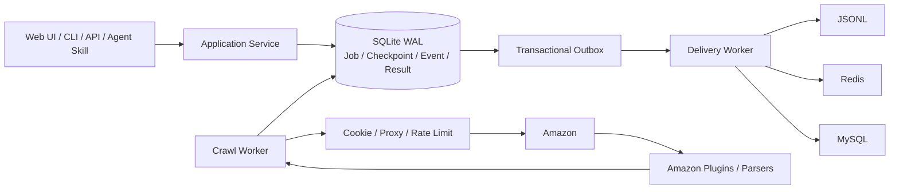

# Amazon Crawler V2

面向 Amazon 数据采集场景的可恢复、可观测爬虫服务。项目提供管理界面、HTTP API、命令行和 Agent Skill，统一承载任务创建、断点续爬、暂停/恢复、结果查询、多存储投递以及 Cookie/代理资源管理。

> 当前阶段：P0 核心能力和离线测试已完成，可以用于本地开发与受控联调。在补齐认证、租户隔离、限流、配额和真实站点验收前，不应直接作为公网生产服务。

## 项目解决什么问题

Amazon 数据采集涉及任务调度、资源管理、页面解析、失败恢复和多目标投递。项目将这些能力收敛为一个标准服务：

- 用统一 Job 模型承载 11 类 Amazon 抓取任务。
- 每个输入项独立保存状态和连续断点，进程退出后可以继续执行。
- 用租约和唯一 lease token 防止多个 Worker 重复提交或迟到提交。
- 把 SQLite 中的标准结果与 JSONL、Redis、MySQL 等下游投递解耦。
- 通过事件、指标和脱敏证据说明任务为何成功、失败或重试。
- 同时服务人工操作、内部系统调用以及受限的 AI Agent 操作。

典型使用场景包括商品详情和实时价格采集、关键词搜索、评论、类目/榜单 ASIN、商家主页与商家商品采集。

## 核心能力

| 能力 | 说明 |
|---|---|
| 断点续爬 | Job、输入项、连续断点、租约、尝试次数和事件均保存在 SQLite WAL 中 |
| 任务控制 | 支持创建、查看、暂停、恢复、取消和幂等提交 |
| 多 Worker | 通过租约、心跳和 lease token 协调并发 Worker，过期任务可重新领取 |
| 多结果存储 | SQLite 为标准结果原本，可通过事务 outbox 投递到 JSONL、Redis 或 MySQL |
| Cookie 管理 | 支持静态 Cookie、Redis Cookie 池、邮编维度选择、隔离、刷新和显式 Cookie 生产 |
| 代理管理 | 支持静态代理和动态代理提取；失败时隔离，不会静默降级为无代理直连 |
| 可观测性 | 提供 Job 事件、结果、投递状态、指标、响应哈希和可选脱敏证据 |
| 多种入口 | 提供 Web 管理界面、REST API、CLI 和 Agent Skill |
| Agent 集成 | Agent Skill 提供受限、可审计的任务操作能力，不暴露 Cookie、代理或连接信息 |

## 支持的任务

| Canonical kind | 用途 |
|---|---|
| `product` | 标准商品详情 |
| `product_hw` | 使用 overseas 资源池的商品详情 |
| `product_time` | 带独立观测时间的实时商品数据 |
| `search` | 关键词搜索结果 |
| `search_hour` | 带小时批次身份的高频搜索结果 |
| `reviews` | 商品评论 |
| `category_asin_list` | 类目 ASIN 列表 |
| `rank_list` | Amazon 榜单数据 |
| `merchant` | 商家信息 |
| `merchant_home` | 商家首页和派生分页任务 |
| `merchant_products` | 商家商品页和派生商品详情任务 |

## 系统结构



抓取成功与 outbox 记录在同一个 SQLite 事务中提交。因此二级存储暂时不可用时，标准结果不会丢失，抓取任务也不会被错误标记为失败；投递 Worker 会单独重试。

## 环境要求

- Python 3.11 或更高版本
- macOS 或 Linux；Windows 建议使用 WSL2
- 真实抓取所需的 Amazon Cookie
- 按运行环境和访问质量选择的 HTTP 代理
- 可选：Redis Cookie 池、MySQL、结果 Redis

## 5 分钟启动

### 1. 获取代码

```bash
git clone https://github.com/chenshan900821-commits/amazon-crawler-v2.git
cd amazon-crawler-v2
```

该仓库目前为私有仓库，克隆账号需要具备访问权限。

### 2. 创建虚拟环境并安装

```bash
python3 -m venv .venv
source .venv/bin/activate
python -m pip install --upgrade pip
python -m pip install -e .
```

### 3. 初始化数据库

```bash
amazon-crawler init-db
```

默认数据库位于 `.data/crawler.db`，程序会按需创建目录。

### 4. 启动管理界面、API 和本地 Worker

```bash
amazon-crawler serve --host 127.0.0.1 --port 3000
```

打开 <http://127.0.0.1:3000> 查看管理界面。健康检查：

```bash
curl http://127.0.0.1:3000/api/v1/health
```

`serve` 默认同时启动 API、Web 管理界面、抓取 Worker 和结果投递 Worker，适合本地开发。此时即使尚未配置 Cookie，控制台仍可启动；但默认 `CRAWLER_REQUIRE_COOKIE=true`，真实抓取任务会因 Cookie 不可用而失败或等待资源。

如果不安装命令行入口，也可以将以上命令写成：

```bash
python -m amazon_crawler init-db
python -m amazon_crawler serve --host 127.0.0.1 --port 3000
```

## 配置真实抓取资源

运行时直接读取进程环境变量，不会自动加载 `.env` 文件。`.env.example` 是配置清单，不是自动生效的配置文件。开发环境可以导出变量，正式环境应通过部署平台的 Secret 管理功能注入敏感值。

最小示例：

```bash
export CRAWLER_AMAZON_COOKIE='<your-cookie>'
export CRAWLER_HTTP_PROXY='http://<proxy-host>:<proxy-port>'
amazon-crawler serve --host 127.0.0.1 --port 3000
```

不要把 Cookie、代理账号、Redis URL 或数据库 URL 提交到 Git。它们也不应通过 Job API 或 Agent 参数传入。

常用配置：

| 环境变量 | 默认值 | 用途 |
|---|---:|---|
| `CRAWLER_DB_PATH` | `.data/crawler.db` | SQLite 状态和标准结果库 |
| `CRAWLER_EVIDENCE_DIR` | `.data/evidence` | 可选脱敏证据目录 |
| `CRAWLER_CAPTURE_EVIDENCE` | `false` | 是否保存解析/页面策略失败证据 |
| `CRAWLER_WORKER_ENABLED` | `true` | `serve` 是否内置抓取 Worker |
| `CRAWLER_WORKER_CONCURRENCY` | `2` | 抓取 Worker 并发数 |
| `CRAWLER_DELIVERY_WORKER_ENABLED` | `true` | `serve` 是否内置结果投递 Worker |
| `CRAWLER_HTTP_TRANSPORT` | `auto` | `auto`、`curl_cffi` 或显式诊断回退 `httpx` |
| `CRAWLER_HTTP_PROXY` | 空 | 固定 HTTP 代理 |
| `CRAWLER_AMAZON_COOKIE` | 空 | 商品等任务使用的静态 Cookie |
| `CRAWLER_MERCHANT_COOKIE` | 空 | 商家和榜单任务使用的专用 Cookie |
| `CRAWLER_REQUIRE_COOKIE` | `true` | 是否强制真实抓取必须具备 Cookie |
| `CRAWLER_COOKIE_REDIS_URL` | 空 | default Cookie 池 |
| `CRAWLER_COOKIE_REDIS_OVERSEAS_URL` | 空 | overseas Cookie 池；`product_hw` 和 JP 链路使用 |
| `CRAWLER_PROXY_EXTRACT_URL` | 空 | 动态代理提取服务地址 |
| `CRAWLER_RESULT_JSONL_DIR` | `.data/result-sinks/jsonl` | JSONL 结果目录 |

更多基础选项和注释见 [`.env.example`](.env.example)，最终有效值仍以 [`src/amazon_crawler/config.py`](src/amazon_crawler/config.py) 为准。

## 创建第一个任务

### 商品详情

服务已经运行时，在另一个终端执行：

```bash
source .venv/bin/activate
amazon-crawler create B0XXXXXXXX \
  --kind product \
  --marketplace US \
  --postal-code 10001
```

命令返回 JSON，其中包含 `job_id`。随后查询任务和结果：

```bash
amazon-crawler show <job_id>
amazon-crawler events <job_id>
amazon-crawler results <job_id>
```

也可以直接提交受支持的 Amazon 商品 URL。URL 必须使用 HTTPS，并属于已允许的 Amazon 站点域名。

### 实时商品观测

```bash
amazon-crawler create B0XXXXXXXX \
  --kind product_time \
  --marketplace US \
  --postal-code 10001 \
  --mode realtime
```

未提供 `add_date` 的 `product_time` 表示“立即产生一次新观测”，每次提交都会创建新任务。调用方重试同一次业务请求时，应提供稳定的 `--idempotency-key`。

### 关键词搜索

```bash
amazon-crawler create \
  --kind search \
  --input-json '{"keyword":"wireless mouse","market_id":"US","post_code":"10001","turn_page":1,"frequent":0}'
```

搜索、类目、榜单和商家任务使用结构化 JSON。完整字段契约见 [`skills/operate-amazon-crawler/references/input-contracts.md`](skills/operate-amazon-crawler/references/input-contracts.md)。

### 不启动 Web 服务，单次执行 Worker

```bash
amazon-crawler create B0XXXXXXXX --kind product --marketplace US
amazon-crawler worker --once
```

`worker --once` 会处理当前可领取的抓取任务和结果投递。持续运行专用 Worker 时去掉 `--once`。

## 通过 HTTP API 调用

创建商品任务：

```bash
curl -X POST http://127.0.0.1:3000/api/v1/jobs \
  -H 'Content-Type: application/json' \
  -d '{
    "kind": "product",
    "inputs": ["B0XXXXXXXX"],
    "marketplace_id": "US",
    "postal_code": "10001",
    "execution_mode": "standard",
    "options": {"result_sinks": ["sqlite"]}
  }'
```

查询任务和结果：

```bash
curl http://127.0.0.1:3000/api/v1/jobs/<job_id>
curl http://127.0.0.1:3000/api/v1/jobs/<job_id>/results
curl http://127.0.0.1:3000/api/v1/jobs/<job_id>/events
```

接口基路径为 `/api/v1`。完整路由、请求字段和安全边界见 [`docs/API.md`](docs/API.md)。API 不接受 Cookie、代理、任意请求头、SQL、解析器代码或非白名单 URL。

## 结果存储

`sqlite` 始终作为标准结果原本。创建任务时可以重复指定 `--result-sink`，让同一结果可靠投递到多个已配置目标：

```bash
amazon-crawler create B0XXXXXXXX \
  --kind product \
  --marketplace US \
  --result-sink sqlite \
  --result-sink jsonl
```

可用 sink：

| Sink | 用途 | 前置条件 |
|---|---|---|
| `sqlite` | 控制面和标准结果原本 | 始终启用 |
| `jsonl` | 本地增量数据流 | 默认可用 |

Redis 和 MySQL 连接器属于扩展存储能力，启用前需要完成连接配置、数据契约确认和外部写入授权。P0 快速启动默认只使用 `sqlite` 和 `jsonl`。

抓取状态与投递状态彼此独立。Job 成功后，二级存储仍可能处于 `pending`、重试或 `dead_letter`，但不会影响 SQLite 中已经提交的标准结果。

## API 与 Worker 分离部署

本地开发可使用单进程 `serve`。需要独立伸缩时，将 API、抓取 Worker 分开运行，并共享同一个持久化数据库路径：

```bash
CRAWLER_WORKER_ENABLED=false \
CRAWLER_DELIVERY_WORKER_ENABLED=false \
amazon-crawler serve --host 0.0.0.0 --port 3000
```

另开进程：

```bash
amazon-crawler worker
```

当前存储使用 SQLite，适合单机多进程和 P0 验证，不适合多节点共享文件系统。未来扩展到多节点时，需要将任务状态、租约、幂等键和 outbox 一并切换到支持跨节点事务与锁语义的数据库，不能只更新结果表。

## Cookie 池与 Cookie 生产

普通服务启动不会自动执行 Cookie 生产。配置 Redis 和代理后，仍需显式确认外部写入：

```bash
amazon-crawler cookie-fill \
  --marketplace US \
  --postal-code 10001 \
  --target 10 \
  --confirm-external-write
```

为 `product_hw` 或 JP 链路补充 overseas 池时增加 `--pool overseas`。Cookie 生产会向 Amazon 发起请求，并向配置的 Cookie Redis 写入带 TTL 的数据；只有在确认站点访问和 Redis 写入均获授权后才能执行。

生产链会建立首页会话、设置配送地址、重新加载页面确认邮编，再补充 locale/currency。只有验证通过的 Cookie 才会写入池。更严格的 US/JP 双站点受控验收流程见 [`docs/CONTROLLED_ACCEPTANCE.md`](docs/CONTROLLED_ACCEPTANCE.md)。

## 开发与测试

运行完整单元测试：

```bash
PYTHONPATH=src:. python -m unittest discover -s tests -v
```

常用静态和契约检查：

```bash
python -m compileall -q src
amazon-crawler capabilities
node --check src/amazon_crawler/interfaces/static/app.js
```

## 项目目录

```text
amazon-crawler-v2/
├── src/amazon_crawler/
│   ├── domain/          # Job、状态、端口和资源领域模型
│   ├── application/     # 服务、抓取 Worker、投递 Worker、Cookie 维护
│   ├── infra/           # SQLite、HTTP、Cookie/代理、证据和结果 sink
│   ├── plugins/         # Amazon 各任务插件与解析器
│   └── interfaces/      # CLI、HTTP API 和 Web 管理界面
├── skills/              # AI Agent Skill 及输入契约
├── contracts/           # 机器可读的数据与验收契约
├── docs/                # 架构、API 和运行文档
├── scripts/             # 审计、采集、回放和证据编译工具
├── tests/               # 单元、契约、恢复和安全边界测试
├── .env.example         # 环境变量清单，不包含真实秘密
└── pyproject.toml       # Python 包和依赖定义
```

## 当前已知边界

- 当前 HTTP 服务没有登录、租户隔离、公网限流、用量配额和结果级授权，不能直接暴露到公网。
- 当前标准状态库是 SQLite；多节点分布式部署尚未实现。
- 真实站点访问仍需持续验证不同国家、邮编、页面形态和限流场景，离线测试不能替代线上验收。
- Cookie 生产代码已通过隔离测试；真实新 Cookie 的成功率仍受代理可用性和 Amazon 风控影响，不能把代码完成等同于生产资源可用。
- 商业化前需要完成目标站点条款、数据合规、访问频率和数据使用范围审查。

## 安全要求

- 不要提交 `.env`、Cookie、代理凭据、数据库 URL、Redis URL、原始响应或包含个人信息的数据。
- 对外运行前必须增加认证、租户授权、审计日志、速率限制、配额和结果访问控制。
- 外部 Cookie、Redis/MySQL 和真实站点采集都需要明确授权；本地测试通过不代表已获生产权限。
- 证据和事件只应保存经过白名单过滤及脱敏的字段。

## 进一步阅读

- [`docs/ARCHITECTURE.md`](docs/ARCHITECTURE.md)：分层、状态机、断点、资源和多存储设计
- [`docs/API.md`](docs/API.md)：HTTP API v1

## 许可证

本仓库当前未声明开源许可证。未经仓库所有者许可，不应复制、再分发或将代码用于其他商业项目。
