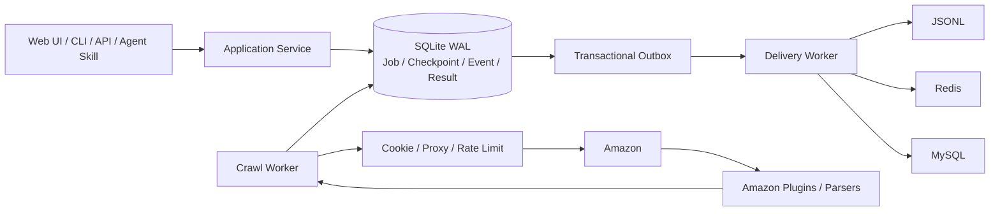

# Amazon Crawler V2

面向 Amazon 数据采集场景的可恢复、可观测爬虫服务。项目提供管理界面、HTTP API、命令行和 Agent Skill，统一承载任务创建、断点续爬、暂停/恢复、结果查询、多存储投递以及 Cookie/代理资源管理。

> 当前阶段：P0 核心能力和离线测试已完成，可以用于本地开发与受控联调。在补齐认证、租户隔离、限流、配额和真实站点验收前，不应直接作为公网生产服务。

## 项目解决什么问题

Amazon 数据采集涉及任务调度、资源管理、页面解析、失败恢复和多目标投递。项目将这些能力收敛为一个标准服务：

- 用统一 Job 模型承载 11 类 Amazon 抓取任务。
- 每个输入项独立保存状态和连续断点，进程退出后可以继续执行。
- 用租约和唯一 lease token 防止多个 Worker 重复提交或迟到提交。
- 把 SQLite 中的标准结果与 JSONL、Redis、MySQL 等下游投递解耦。
- 通过事件、指标和脱敏证据说明任务为何成功、失败或重试。
- 同时服务人工操作、内部系统调用以及受限的 AI Agent 操作。

典型使用场景包括商品详情和实时价格采集、关键词搜索、评论、类目/榜单 ASIN、商家主页与商家商品采集。

## 核心能力

| 能力 | 说明 |
|---|---|
| 断点续爬 | Job、输入项、连续断点、租约、尝试次数和事件均保存在 SQLite WAL 中 |
| 任务控制 | 支持创建、查看、暂停、恢复、取消和幂等提交 |
| 多 Worker | 通过租约、心跳和 lease token 协调并发 Worker，过期任务可重新领取 |
| 多结果存储 | SQLite 为标准结果原本，可通过事务 outbox 投递到 JSONL、Redis 或 MySQL |
| Cookie 管理 | 支持静态 Cookie、Redis Cookie 池、邮编维度选择、隔离、刷新和显式 Cookie 生产 |
| 代理管理 | 支持静态代理和动态代理提取；失败时隔离，不会静默降级为无代理直连 |
| 可观测性 | 提供 Job 事件、结果、投递状态、指标、响应哈希和可选脱敏证据 |
| 多种入口 | 提供 Web 管理界面、REST API、CLI 和 Agent Skill |
| Agent 集成 | Agent Skill 提供受限、可审计的任务操作能力，不暴露 Cookie、代理或连接信息 |

## 支持的任务

| Canonical kind | 用途 |
|---|---|
| `product` | 标准商品详情 |
| `product_hw` | 使用 overseas 资源池的商品详情 |
| `product_time` | 带独立观测时间的实时商品数据 |
| `search` | 关键词搜索结果 |
| `search_hour` | 带小时批次身份的高频搜索结果 |
| `reviews` | 商品评论 |
| `category_asin_list` | 类目 ASIN 列表 |
| `rank_list` | Amazon 榜单数据 |
| `merchant` | 商家信息 |
| `merchant_home` | 商家首页和派生分页任务 |
| `merchant_products` | 商家商品页和派生商品详情任务 |

## 系统结构



抓取成功与 outbox 记录在同一个 SQLite 事务中提交。因此二级存储暂时不可用时，标准结果不会丢失，抓取任务也不会被错误标记为失败；投递 Worker 会单独重试。

## 环境要求

- Python 3.11 或更高版本
- macOS 或 Linux；Windows 建议使用 WSL2
- 真实抓取所需的 Amazon Cookie
- 按运行环境和访问质量选择的 HTTP 代理
- 可选：Redis Cookie 池、MySQL、结果 Redis

## 5 分钟启动

### 1. 获取代码

```bash
git clone https://github.com/chenshan900821-commits/amazon-crawler-v2.git
cd amazon-crawler-v2
```

该仓库目前为私有仓库，克隆账号需要具备访问权限。

### 2. 创建虚拟环境并安装

```bash
python3 -m venv .venv
source .venv/bin/activate
python -m pip install --upgrade pip
python -m pip install -e .
```

### 3. 初始化数据库

```bash
amazon-crawler init-db
```

默认数据库位于 `.data/crawler.db`，程序会按需创建目录。

### 4. 启动管理界面、API 和本地 Worker

```bash
amazon-crawler serve --host 127.0.0.1 --port 3000
```

打开 <http://127.0.0.1:3000> 查看管理界面。健康检查：

```bash
curl http://127.0.0.1:3000/api/v1/health
```

`serve` 默认同时启动 API、Web 管理界面、抓取 Worker 和结果投递 Worker，适合本地开发。此时即使尚未配置 Cookie，控制台仍可启动；但默认 `CRAWLER_REQUIRE_COOKIE=true`，真实抓取任务会因 Cookie 不可用而失败或等待资源。

如果不安装命令行入口，也可以将以上命令写成：

```bash
python -m amazon_crawler init-db
python -m amazon_crawler serve --host 127.0.0.1 --port 3000
```

## 一次完整可运行流程

下面是一条从“运行资源就绪”到“拿到并检查结果”的主路径。首次使用建议按顺序执行，不要把“服务已启动”“Cookie 获取请求已结束”误认为真实采集已经成功。

### 第 1 步：准备本机配置

```bash
cp .env.example .env
chmod 600 .env
```

在 `.env` 中选择一种已获授权的 Cookie 来源：

| Cookie 来源 | 适用情况 | 必须配置 |
|---|---|---|
| Redis Cookie 池（推荐） | 已有多个站点/邮编会话，或需要持续补充会话 | `CRAWLER_COOKIE_REDIS_URL`；海外池另配 `CRAWLER_COOKIE_REDIS_OVERSEAS_URL` |
| 静态 Cookie | 单站点、单会话的受控联调 | `CRAWLER_AMAZON_COOKIE` |
| 新 Cookie 获取 | 需要创建匿名配送区域会话并写入 Redis | Redis Cookie 池、可用代理、`CRAWLER_COOKIE_OPERATIONS_API_ENABLED=true` |

动态代理使用 `CRAWLER_PROXY_EXTRACT_URL`，固定代理使用 `CRAWLER_HTTP_PROXY`。真实值只放在本机 `.env` 或部署平台 Secret 管理中；不要通过页面、Job API 或 Agent 参数传入。字段含义和示例见下一节“配置真实抓取资源”。

加载配置并初始化：

```bash
source .venv/bin/activate
set -a
source .env
set +a
amazon-crawler init-db
```

### 第 2 步：启动并检查能力

```bash
amazon-crawler serve --host 127.0.0.1 --port 3000
```

保持服务运行，在另一个已经加载同一份 `.env` 的终端检查：

```bash
curl http://127.0.0.1:3000/api/v1/health
curl http://127.0.0.1:3000/api/v1/capabilities
curl http://127.0.0.1:3000/api/v1/cookie-pools
```

继续执行真实采集前，应确认：

- `/health` 返回 `ok: true`。
- `/capabilities` 中包含准备执行的任务类型和结果去向。
- 使用 Cookie 获取功能时，`/cookie-pools` 的 `feature.api_enabled` 为 `true`，目标池的 `configured` 为 `true`，并且 `tls_impersonation` 为 `true`。
- 首页“健康 Cookie”显示的是当前服务进程已经加载到缓存中的安全计数；显示“待刷新”表示 Worker 尚未读取资源池，不代表 Redis 中一定没有 Cookie。已确认池内有可用 Cookie 时，不需要先生产新 Cookie，可以直接创建采集任务并从任务事件验证资源领取结果。

### 第 3 步：仅在需要时获取新 Cookie

方式一：打开 <http://127.0.0.1:3000>，在“Amazon Cookie 资源”区域选择池和站点。系统会自动显示并使用该站点的预设配送区域；只需输入目标容量，确认已获外部操作授权后执行。页面仅展示已经配置默认配送区域的站点，不要求用户手动填写邮编。

方式二：使用命令行调用同一生产内核：

```bash
amazon-crawler cookie-fill \
  --pool default \
  --marketplace US \
  --target 1 \
  --confirm-external-write
```

命令行同样会自动选择站点默认值。只有执行多邮编受控验收时，运维人员才需要使用可选的 `--postal-code` 显式覆盖；普通页面和日常补池不开放这个输入。

**Cookie Gate：只有响应中的 `satisfied=true` 且 `report.available_after >= report.requested` 才表示目标容量已满足。** `created=0` 不一定是失败——当池内原本已经达到目标容量时也会返回 0；反过来，命令正常结束但 `satisfied=false` 仍然不能算成功。未通过该门槛时，先按失败码处理代理或 Amazon 风控，不要假定系统已经拿到新 Cookie。

### 第 4 步：创建真实采集任务

首页可直接选择“关键词搜索”，填写 `wireless mouse`、站点 `US`、邮编 `10001` 后创建。对应的命令行是：

```bash
amazon-crawler create \
  --kind search \
  --input-json '{"keyword":"wireless mouse","market_id":"US","post_code":"10001","turn_page":1,"frequent":0}'
```

商品任务需要把示例 ASIN 替换为真实的 10 位 ASIN：

```bash
amazon-crawler create B07FZ8S74R \
  --kind product \
  --marketplace US \
  --postal-code 10001
```

`serve` 默认已包含 Worker，会自动领取任务。如果 API 与 Worker 分开运行，或者只希望执行一轮队列，则运行：

```bash
amazon-crawler worker --once
```

### 第 5 步：查看状态、证据与结果

创建命令返回的任务编号位于 `job.id`。把它填入下面的本地变量：

```bash
JOB_ID='JOB_ID_FROM_CREATE_RESPONSE'
amazon-crawler show "$JOB_ID"
amazon-crawler events "$JOB_ID"
amazon-crawler results "$JOB_ID"
amazon-crawler deliveries "$JOB_ID"
```

也可以在首页任务编队中打开任务详情，查看逐项状态、失败码、事件、结果、字段覆盖率以及脱敏证据哈希。

**Result Gate：任务状态为 `succeeded` 且结果数量大于 0，才表示全部输入已完成；`partial` 表示已有可用结果，但仍需查看失败输入和事件；`failed` 或结果数量为 0 时不能进入下游业务。** SQLite 标准结果位于 `.data/crawler.db`，启用 `jsonl` 去向后，增量文件位于 `.data/result-sinks/jsonl`。

### 失败码怎么判断

| 失败码 | 含义 | 优先处理 |
|---|---|---|
| `proxy_acquisition_failed` | 动态代理提取接口不可用、响应格式错误或没有有效端口 | 检查提取链接、线路状态、IP 白名单和服务商返回格式 |
| `proxy_unavailable` | 当前没有可用代理，且策略禁止静默直连 | 补充代理资源或等待隔离时间结束；不要为“跑通”而关闭代理门槛 |
| `blocked` | Amazon 返回验证码、风控页或其他拦截页面 | 降低频率、替换健康代理并重新获取会话 |
| `missing_csrf_token` / `missing_validation_token` | 当前页面形态或会话未提供地址设置所需令牌 | 检查站点、出口地区、页面是否被降级或拦截 |
| `invalid_address` / `address_not_applied` | 邮编无效，或重新读取页面后配送区域未生效 | 核对站点与邮编组合，再检查 Cookie 与代理是否保持同一会话 |
| `network_error` | 请求超时、连接中断或代理链路波动 | 先检查代理连通性和超时配置，再利用任务重试/断点恢复 |

本机受控验收记录（2026-08-28）：使用已获授权的 Redis Cookie 池和动态代理，关键词搜索任务成功返回 16 条标准结果，结果已写入 SQLite；新 Cookie 获取链路能够执行并返回安全失败码，但当次代理质量与 Amazon 风控未让 `Cookie Gate` 达标，因此没有把无效会话写入池。该记录证明现有池的采集主路径可运行，不代表任意时刻、任意代理都能生产新 Cookie。

## 配置真实抓取资源

运行时直接读取进程环境变量，不会自动加载 `.env`。仓库中的 [`.env.example`](.env.example) 只定义字段、格式和安全默认值，所有 Cookie、代理及 Redis 凭证都必须保持为空。

本地开发可以复制一份仅供本机使用的配置：

```bash
cp .env.example .env
chmod 600 .env
```

编辑 `.env` 后，在启动进程的同一个终端加载：

```bash
set -a
source .env
set +a
amazon-crawler serve --host 127.0.0.1 --port 3000
```

`.env` 已被 Git 忽略。正式部署应使用部署平台的 Secret 管理功能，不要把 Cookie、代理账号、提取链接或 Redis URL 写进镜像、启动脚本、Job API 或 Agent 参数。

### Amazon Cookie 填什么

`CRAWLER_AMAZON_COOKIE` 需要的是目标 Amazon 站点一次有效请求中的完整 `Cookie` 请求头，不是 `Set-Cookie` 响应头，也不是 Amazon 账号密码。

取得方式：在已获授权的浏览器会话中打开对应 Amazon 站点，使用开发者工具的 Network 面板选择一个正常返回的文档请求，在 Request Headers 中复制完整 `Cookie` 值。Cookie 必须与目标站点、配送邮编和会话区域匹配。

支持两种格式：

```bash
# 推荐：完整 Cookie 请求头。放进 .env 时使用单引号包住整段内容。
CRAWLER_AMAZON_COOKIE='session-id=SESSION_ID_VALUE; ubid-main=UBID_VALUE; lc-main=en_US'

# 也支持 JSON 对象。
CRAWLER_AMAZON_COOKIE='{"session-id":"SESSION_ID_VALUE","ubid-main":"UBID_VALUE","lc-main":"en_US"}'
```

上面的 `SESSION_ID_VALUE` 和 `UBID_VALUE` 是格式标记，必须替换为本人已授权会话中的实际值，不能原样使用。不同站点的 Cookie 名可能不同，因此不要只复制示例中的三个字段；优先复制完整请求头。

`CRAWLER_MERCHANT_COOKIE` 使用相同格式，仅在商家和榜单任务需要独立会话时配置。未配置 Redis Cookie 池时，普通任务使用 `CRAWLER_AMAZON_COOKIE`。

### 固定代理填什么

只有一个长期可用代理时，配置完整代理 URL：

```bash
# 无认证代理
CRAWLER_HTTP_PROXY='http://PROXY_HOST:PROXY_PORT'
```

带认证的固定代理使用标准 URL userinfo 结构，将下面三段按顺序拼接，并把完整结果作为 `CRAWLER_HTTP_PROXY` 的值：

1. scheme：`http://`
2. 认证部分：`PROXY_USER:PROXY_PASSWORD@`
3. 地址部分：`PROXY_HOST:PROXY_PORT`

- `PROXY_HOST`：代理服务商分配的 IP 或域名。
- `PROXY_PORT`：代理端口，例如隧道代理端口。
- `PROXY_USER` / `PROXY_PASSWORD`：代理隧道认证账号和密码，不是服务商网站的登录账号。
- 用户名或密码包含 `@`、`:`、`/` 等特殊字符时，需要先进行 URL percent-encoding。

推荐使用 `http://` 或 `https://` 代理 URL。不要把代理地址直接写入代码。

### 青果动态代理填什么

使用青果的提取型代理时，配置以下三个通用变量，不需要修改 Python 代码：

```bash
CRAWLER_PROXY_EXTRACT_URL='PASTE_FULL_QINGGUO_EXTRACTION_API_URL_HERE'
CRAWLER_PROXY_USERNAME='QINGGUO_TUNNEL_USERNAME'
CRAWLER_PROXY_PASSWORD='QINGGUO_TUNNEL_PASSWORD'
```

- `CRAWLER_PROXY_EXTRACT_URL`：从青果控制台生成的完整代理提取链接。链接中的 token、签名或白名单参数都属于秘密。
- `CRAWLER_PROXY_USERNAME`：青果代理隧道认证用户名。
- `CRAWLER_PROXY_PASSWORD`：青果代理隧道认证密码。
- 提取接口必须以纯文本返回代理，每行一个 `host:port`、`http://host:port` 或 `https://host:port`；当前不接受 HTML 或 JSON 响应。

如果青果采用 IP 白名单而不要求隧道账号，用户名和密码保持为空。配置 `CRAWLER_PROXY_EXTRACT_URL` 后，动态代理池优先于 `CRAWLER_HTTP_PROXY`；提取失败时系统会进入冷却并报告资源错误，不会偷偷改成直连。

当前一个服务进程只能使用一套动态代理提取链接和一组隧道凭证，并由所有任务共享。如果不同站点或任务必须使用不同青果线路，当前版本还需要增加按站点/任务类型路由的 Proxy Provider；不能仅启动多个 Worker 就假定任务会进入正确线路。

### Redis Cookie 池填什么

需要按站点和邮编管理多个 Cookie 时，配置完整 Redis 连接 URL：

```bash
CRAWLER_COOKIE_REDIS_URL='redis://REDIS_HOST:REDIS_PORT/REDIS_DB'
CRAWLER_COOKIE_REDIS_OVERSEAS_URL='redis://REDIS_HOST:REDIS_PORT/OVERSEAS_DB'
```

Redis 需要密码时，将下面三段按顺序拼接，并把完整结果写入对应变量：

1. scheme：`redis://`
2. 认证部分：`:REDIS_PASSWORD@`
3. 地址部分：`REDIS_HOST:REDIS_PORT/REDIS_DB`

- `CRAWLER_COOKIE_REDIS_URL`：default Cookie 池。
- `CRAWLER_COOKIE_REDIS_OVERSEAS_URL`：`product_hw` 以及 JP 资源路由使用的 overseas Cookie 池。
- `REDIS_HOST` / `REDIS_PORT`：Redis 服务的域名或 IP 与端口。
- `REDIS_PASSWORD`：Redis 连接密码；无密码部署时删除 URL 中的 `:REDIS_PASSWORD@`。
- `REDIS_DB` / `OVERSEAS_DB`：Redis database 编号，例如 `0`、`4`，不是数据库名称。
- Redis key 格式为 `cookie:{marketplace}:{postal_code}:{id}`。
- Redis value 可以是 Cookie JSON 对象，也可以是完整 Cookie 请求头字符串。
- 使用 TLS Redis 时将 scheme 改为 `rediss://`。

Redis 密码包含特殊字符时同样需要 percent-encoding。只要配置了 default Redis Cookie 池，它就优先于 `CRAWLER_AMAZON_COOKIE`。

### 其余运行参数

| 环境变量 | 默认值 | 什么时候修改 |
|---|---:|---|
| `CRAWLER_DB_PATH` | `.data/crawler.db` | 修改 SQLite 持久化位置时 |
| `CRAWLER_EVIDENCE_DIR` | `.data/evidence` | 修改脱敏证据目录时 |
| `CRAWLER_RESULT_JSONL_DIR` | `.data/result-sinks/jsonl` | 修改 JSONL 结果目录时 |
| `CRAWLER_CAPTURE_EVIDENCE` | `false` | 需要保存解析失败证据时开启 |
| `CRAWLER_WORKER_ENABLED` | `true` | API 与 Worker 分离部署时设为 `false` |
| `CRAWLER_WORKER_CONCURRENCY` | `2` | 根据代理容量和限流策略调整抓取并发 |
| `CRAWLER_DELIVERY_WORKER_ENABLED` | `true` | 独立运行结果投递 Worker 时设为 `false` |
| `CRAWLER_REQUEST_TIMEOUT_SECONDS` | `25` | 网络延迟较高时适当增加 |
| `CRAWLER_MIN_HOST_INTERVAL_SECONDS` | `1.5` | 控制同一站点的最小请求间隔 |
| `CRAWLER_HTTP_TRANSPORT` | `auto` | 正常保持 `auto`；`httpx` 仅用于诊断 |
| `CRAWLER_USER_AGENT` | Chrome 131 UA | 一般不修改；必须与 TLS/browser 模拟配置保持一致 |
| `CRAWLER_REQUIRE_COOKIE` | `true` | 正常抓取保持 `true`；无 Cookie 模式仅限受控诊断 |
| `CRAWLER_COOKIE_OPERATIONS_API_ENABLED` | `false` | 只在管理服务已限制为授权运维人员访问时开启页面/API 获取功能 |
| `CRAWLER_PROXY_QUARANTINE_SECONDS` | `300` | 调整失败代理的隔离时间 |

所有公开运行字段、默认值和注释见 [`.env.example`](.env.example)，最终读取逻辑见 [`src/amazon_crawler/config.py`](src/amazon_crawler/config.py)。

## 创建第一个任务

以下命令中的 `B0XXXXXXXX` 是一个合成 ASIN 格式标记。执行真实任务前，必须替换为目标商品详情页 `/dp/` 后面的 10 位 ASIN；它本身不代表真实商品。

### 商品详情

服务已经运行时，在另一个终端执行：

```bash
source .venv/bin/activate
amazon-crawler create B0XXXXXXXX \
  --kind product \
  --marketplace US \
  --postal-code 10001
```

命令返回 JSON，任务编号位于 `job.id`。将该值赋给本地变量后查询任务和结果：

```bash
JOB_ID='JOB_ID_FROM_CREATE_RESPONSE'
amazon-crawler show "$JOB_ID"
amazon-crawler events "$JOB_ID"
amazon-crawler results "$JOB_ID"
```

`JOB_ID_FROM_CREATE_RESPONSE` 必须替换为刚才返回的真实 `job.id`，不能原样执行。

也可以直接提交受支持的 Amazon 商品 URL。URL 必须使用 HTTPS，并属于已允许的 Amazon 站点域名。

### 实时商品观测

```bash
amazon-crawler create B0XXXXXXXX \
  --kind product_time \
  --marketplace US \
  --postal-code 10001 \
  --mode realtime
```

未提供 `add_date` 的 `product_time` 表示“立即产生一次新观测”，每次提交都会创建新任务。调用方重试同一次业务请求时，应提供稳定的 `--idempotency-key`。

### 关键词搜索

```bash
amazon-crawler create \
  --kind search \
  --input-json '{"keyword":"wireless mouse","market_id":"US","post_code":"10001","turn_page":1,"frequent":0}'
```

搜索、类目、榜单和商家任务使用结构化 JSON。完整字段契约见 [`skills/operate-amazon-crawler/references/input-contracts.md`](skills/operate-amazon-crawler/references/input-contracts.md)。

### 不启动 Web 服务，单次执行 Worker

```bash
amazon-crawler create B0XXXXXXXX --kind product --marketplace US
amazon-crawler worker --once
```

`worker --once` 会处理当前可领取的抓取任务和结果投递。持续运行专用 Worker 时去掉 `--once`。

## 通过 HTTP API 调用

创建商品任务：

```bash
curl -X POST http://127.0.0.1:3000/api/v1/jobs \
  -H 'Content-Type: application/json' \
  -d '{
    "kind": "product",
    "inputs": ["B0XXXXXXXX"],
    "marketplace_id": "US",
    "postal_code": "10001",
    "execution_mode": "standard",
    "options": {"result_sinks": ["sqlite"]}
  }'
```

查询任务和结果：

```bash
JOB_ID='JOB_ID_FROM_POST_RESPONSE'
curl "http://127.0.0.1:3000/api/v1/jobs/${JOB_ID}"
curl "http://127.0.0.1:3000/api/v1/jobs/${JOB_ID}/results"
curl "http://127.0.0.1:3000/api/v1/jobs/${JOB_ID}/events"
```

`JOB_ID_FROM_POST_RESPONSE` 表示 POST `/jobs` 响应中的 `job.id`。

接口基路径为 `/api/v1`。完整路由、请求字段和安全边界见 [`docs/API.md`](docs/API.md)。API 不接受 Cookie、代理、任意请求头、SQL、解析器代码或非白名单 URL。

## 结果存储

`sqlite` 始终作为标准结果原本。创建任务时可以重复指定 `--result-sink`，让同一结果可靠投递到多个已配置目标：

```bash
amazon-crawler create B0XXXXXXXX \
  --kind product \
  --marketplace US \
  --result-sink sqlite \
  --result-sink jsonl
```

可用 sink：

| Sink | 用途 | 前置条件 |
|---|---|---|
| `sqlite` | 控制面和标准结果原本 | 始终启用 |
| `jsonl` | 本地增量数据流 | 默认可用 |

Redis 和 MySQL 连接器属于扩展存储能力，启用前需要完成连接配置、数据契约确认和外部写入授权。P0 快速启动默认只使用 `sqlite` 和 `jsonl`。

抓取状态与投递状态彼此独立。Job 成功后，二级存储仍可能处于 `pending`、重试或 `dead_letter`，但不会影响 SQLite 中已经提交的标准结果。

## API 与 Worker 分离部署

本地开发可使用单进程 `serve`。需要独立伸缩时，将 API、抓取 Worker 分开运行，并共享同一个持久化数据库路径：

```bash
CRAWLER_WORKER_ENABLED=false \
CRAWLER_DELIVERY_WORKER_ENABLED=false \
amazon-crawler serve --host 0.0.0.0 --port 3000
```

另开进程：

```bash
amazon-crawler worker
```

当前存储使用 SQLite，适合单机多进程和 P0 验证，不适合多节点共享文件系统。未来扩展到多节点时，需要将任务状态、租约、幂等键和 outbox 一并切换到支持跨节点事务与锁语义的数据库，不能只更新结果表。

## Cookie 池与 Cookie 生产

Cookie 获取已经是管理界面中的独立功能。它会建立新的 Amazon 匿名会话、根据站点选择预设配送区域、回读页面确认地址生效，并将验证通过的 Cookie 写入 Redis 池。页面只接收资源池、站点和目标容量，不接收或显示 Cookie、代理凭证、提取链接及 Redis URL。

该入口默认关闭。先通过本机 `.env` 或部署平台 Secret 管理配置 Redis 与代理，再显式开启运维入口：

```bash
CRAWLER_COOKIE_OPERATIONS_API_ENABLED=true
```

重启服务后，在首页的“Amazon Cookie 资源”区域选择资源池和站点。系统会自动展示该站点的配送区域；填写目标池容量并勾选外部操作授权确认即可。页面会返回：实际配送区域、本次新建数、拒绝数、当前可用数以及安全失败码，不返回 Cookie 值。单次目标容量上限为 50，同一个池同时只允许一个获取操作。

若页面显示“运维 API 已关闭”，说明上述开关尚未开启；若显示“未配置 Redis 池”，说明 `CRAWLER_COOKIE_REDIS_URL` 和 `CRAWLER_COOKIE_REDIS_OVERSEAS_URL` 均未形成可用的 Cookie 生产池。默认 `CRAWLER_COOKIE_HARVEST_REQUIRE_PROXY=true`，没有可用代理时会安全失败，不会悄悄改为直连。

也可以使用命令行执行同一生产内核。普通服务启动不会自动执行 Cookie 生产，命令行仍需显式确认外部写入：

```bash
amazon-crawler cookie-fill \
  --marketplace US \
  --target 10 \
  --confirm-external-write
```

为 `product_hw` 或 JP 链路补充 overseas 池时增加 `--pool overseas`。普通补池无需 `--postal-code`；多邮编受控验收可显式覆盖。Cookie 生产会向 Amazon 发起请求，并向配置的 Cookie Redis 写入带 TTL 的数据；只有在确认站点访问和 Redis 写入均获授权后才能执行。

生产链会建立首页会话、设置配送地址、重新加载页面确认邮编，再补充 locale/currency。只有验证通过的 Cookie 才会写入池。更严格的 US/JP 双站点受控验收流程见 [`docs/CONTROLLED_ACCEPTANCE.md`](docs/CONTROLLED_ACCEPTANCE.md)。

Cookie 获取属于人工运维权限，不属于抓取任务输入，也没有加入仓库中的 AI Agent Skill。当前 HTTP 服务没有登录和租户授权，因此即使开启了该开关，也只能绑定本机或放在具备认证、授权、审计和限流的内部控制面之后，不能直接暴露到公网。

## 开发与测试

运行完整单元测试：

```bash
PYTHONPATH=src:. python -m unittest discover -s tests -v
```

常用静态和契约检查：

```bash
python -m compileall -q src
amazon-crawler capabilities
node --check src/amazon_crawler/interfaces/static/app.js
```

## 项目目录

```text
amazon-crawler-v2/
├── src/amazon_crawler/
│   ├── domain/          # Job、状态、端口和资源领域模型
│   ├── application/     # 服务、抓取 Worker、投递 Worker、Cookie 维护
│   ├── infra/           # SQLite、HTTP、Cookie/代理、证据和结果 sink
│   ├── plugins/         # Amazon 各任务插件与解析器
│   └── interfaces/      # CLI、HTTP API 和 Web 管理界面
├── skills/              # AI Agent Skill 及输入契约
├── contracts/           # 机器可读的数据与验收契约
├── docs/                # 架构、API 和运行文档
├── scripts/             # 审计、采集、回放和证据编译工具
├── tests/               # 单元、契约、恢复和安全边界测试
├── .env.example         # 环境变量清单，不包含真实秘密
└── pyproject.toml       # Python 包和依赖定义
```

## 当前已知边界

- 当前 HTTP 服务没有登录、租户隔离、公网限流、用量配额和结果级授权，不能直接暴露到公网。
- 当前标准状态库是 SQLite；多节点分布式部署尚未实现。
- 真实站点访问仍需持续验证不同国家、邮编、页面形态和限流场景，离线测试不能替代线上验收。
- Cookie 生产代码已通过隔离测试；真实新 Cookie 的成功率仍受代理可用性和 Amazon 风控影响，不能把代码完成等同于生产资源可用。
- 商业化前需要完成目标站点条款、数据合规、访问频率和数据使用范围审查。

## 安全要求

- 不要提交 `.env`、Cookie、代理凭据、数据库 URL、Redis URL、原始响应或包含个人信息的数据。
- 对外运行前必须增加认证、租户授权、审计日志、速率限制、配额和结果访问控制。
- 外部 Cookie、Redis/MySQL 和真实站点采集都需要明确授权；本地测试通过不代表已获生产权限。
- 证据和事件只应保存经过白名单过滤及脱敏的字段。

## 进一步阅读

- [`docs/ARCHITECTURE.md`](docs/ARCHITECTURE.md)：分层、状态机、断点、资源和多存储设计
- [`docs/API.md`](docs/API.md)：HTTP API v1

## 许可证

本仓库当前未声明开源许可证。未经仓库所有者许可，不应复制、再分发或将代码用于其他商业项目。
